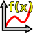
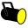

Q Light Controller Plus (kurz QLC+) dient zur Steuerung von Beleuchtungsanlagen, die bei verschiedenen Veranstaltungen wie Live-Konzerten, Theateraufführungen usw. zum Einsatz kommen. Das Hauptziel besteht darin, dass QLC+ durch eine intuitive und flexible Benutzeroberfläche kommerzielle Lichtpulte übertrifft, ohne dass ein über 500 Seiten starkes Handbuch erforderlich ist.

Diese Seite ist (nach den englischen Bezeichnungen der Konzepte) alphabetisch geordnet, um die Suche nach einem bestimmten Thema zu erleichtern.

###  Audio

Eine Audio-[Funktion](#funktionen) ist ein Objekt, das eine auf einer Festplatte gespeicherte Audiodatei darstellt.  
QLC+ unterstützt die gängigsten Audioformate wie Wave, MP3, M4A, Ogg und Flac. Es unterstützt Mono- oder Stereokanäle sowie verschiedene Abtastraten wie 44,1 kHz, 48 kHz usw.  
Audio-Funktionen können über das [Show-Manager](/show-manager)-Fenster zum gewünschten Zeitpunkt in einen [Chaser](#chaser) oder in eine [Show](#show) eingefügt werden.  
Wie die meisten QLC+-Funktionen unterstützt auch Audio Ein- und Ausblendzeiten.  

###  Blackout

Blackout ist ein spezielles QLC+-Feature, mit der alle [HTP](#htp-highest-takes-precedence)-Kanäle in allen Universen auf Null gesetzt werden können. Dies bewirkt, dass die Lichtleistung aller Geräte unterbrochen wird. Die Kanäle bleiben auf Null, unabhängig von aktuell laufenden Funktionen oder manuell zugewiesenen Werten (beispielsweise aus dem [Simple Desk](/simple-desk)). Wenn der Blackout ausgeschaltet wird, werden alle Kanäle wieder durch Funktionen oder ihre manuell eingestellten Werte gesteuert. 

### Funktionen

Einige Kanäle in intelligenten Leuchten bieten viele verschiedene Funktionen, sogenannte _Fähigkeiten_, wie beispielsweise das Einschalten der Lampe, wenn der Kanalwert zwischen \[240\] und \[255\] liegt, das Einstellen einer roten Farbe auf einem Farbrad, wenn der Wert genau \[15\] beträgt, oder einfach die Steuerung der Dimmerintensität der Leuchte mit Werten zwischen \[0\] und \[255\]. Jede dieser einzelnen Funktionen wird als „Fähigkeit“ bezeichnet und verfügt über die folgenden drei Eigenschaften:

*   Minimalwert: Der minimale Kanalwert, der eine Fähigkeit bereitstellt.
*   Maximalwert: Der maximale Kanalwert, der eine Fähigkeit bereitstellt.
*   Name: Der benutzerfreundliche Name einer Fähigkeit
*   Voreinstellung: Eine vordefinierte Funktionalität, damit QLC+ genau erkennt, wie ein Kanalwert zu behandeln und zu simulieren ist

###  Chaser

Eine Chaser-[Funktion](#funktionen) besteht aus mehreren Szenen, die nacheinander ablaufen, sobald die Chaser-Funktion gestartet wird. Die nächste Funktion wird erst ausgeführt, nachdem die vorherige beendet ist. Es können beliebig viele [Funktionen](#funktionen) in einen Chaser eingefügt werden.

Die Richtung der Chaser-Funktion kann umgekehrt oder zufällig gestaltet werden. Die Chaser-Funktion kann auch so eingestellt werden, dass sie eine Endlosschleife oder eine unendliche Ping-Pong-Schleife (die Richtung wird nach jedem Durchlauf umgekehrt) ausführt, oder sie kann nur einmal im Single-Shot-Modus durchlaufen, woraufhin sie sich selbst beendet. Wenn die Funktion auf eine Endlosschleife eingestellt ist, muss sie manuell gestoppt werden.

Jeder Chaser verfügt über eigene Geschwindigkeitseinstellungen:

*   **Einblenden:** Die Einblendgeschwindigkeit eines Schritts
*   **Halten:** Die Haltezeit eines Schritts
*   **Ausblenden:** Die Ausblendgeschwindigkeit eines Schritts
*   **Dauer:** Die Dauer eines Schritts

Kopien von Chaser-Funktionen können mit dem [Funktionsmanager](/function-manager) erstellt werden. Die Szenen innerhalb eines Chasers werden beim Kopieren des Chasers nicht dupliziert. Nur die Reihenfolge und die Richtung werden in den neuen Chaser kopiert.

### Click And Go

Click And Go ist eine Technologie, die es dem Benutzer ermöglicht, schnell und auf vollständig visuelle Weise mit nur wenigen Klicks auf Makros und Farben zuzugreifen. Dies kann zu effizienteren Live-Shows führen und mehr Freiheit bieten, das gewünschte Ergebnis ganz einfach auszuwählen.  
Bisher sind drei Arten von Widgets verfügbar:

*   Einzelfarbe (gilt für: Rot-, Grün-, Blau-, Cyan-, Gelb-, Magenta-, Amber- und Weiß-Intensitätskanäle)
*   RGB-Farbauswahl: steuert die Werte für ausgewählte RGB-Kanäle mit einem einzigen Klick
*   Gobo-/Makro-Auswahl: greift auf ein in der Fixture-Definition festgelegtes Gobo/Makro zu und zeigt es an

Eine Übersicht mit Screenshots ist [hier](https://www.qlcplus.org/old/clickandgo.html) verfügbar

###  Sammlung

Eine Sammlungs[funktion](#funktionen) fasst mehrere Funktionen zusammen, die bei der Ausführung der Sammlungsfunktion gleichzeitig ausgeführt werden. Es kann eine beliebige Anzahl von Funktionen in eine Sammlung eingefügt werden, jedoch darf jede Funktion nur einmal eingefügt werden, und eine Sammlung kann kein direktes Mitglied ihrer selbst sein.

Sammlungen haben keine Geschwindigkeitseinstellungen. Die Geschwindigkeit jeder einzelnen Funktion wird über deren eigenen Editor individuell festgelegt.

Kopien von Sammlungsfunktionen können mit dem [Funktionsmanager](/function-manager) erstellt werden. Die in einer Sammlung enthaltenen Funktionen werden dabei nicht dupliziert; es wird lediglich die Liste der Funktionen kopiert.

### DMX

[DMX](https://en.wikipedia.org/wiki/DMX512) ist die Abkürzung für Digital MultipleX. Es definiert im Wesentlichen eine ganze Reihe von Eigenschaften, Protokollen, Verkabelungen usw. Im Falle von Beleuchtungssoftware legt es die maximale Anzahl von Kanälen (512) pro Universum und den Wertebereich jedes Kanals (0–255) fest.

QLC+ unterstützt eine unbegrenzte Anzahl von Universen (es gibt zunächst 4, bei Bedarf können jedoch weitere hinzugefügt werden). Diese müssen nicht unbedingt mit DMX-Hardware verbunden sein. Die eigentliche Hardware-Abstraktion (analog 0–10 V, DMX oder eine andere Methode) wird über [Ausgangs-Plugins](#eingabe-ausgabe-plugins) erreicht.

###  EFX

Eine EFX-[Funktion](#funktionen) wird hauptsächlich zur Automatisierung von Moving Lights (z. B. Scannern und Moving Heads) verwendet, kann aber auch RGB- oder Dimmerwerte von nicht beweglichen Leuchten automatisieren. Die EFX kann komplexe mathematische Pfade auf einer X-Y-Ebene erstellen, die in DMX-Werte für die Schwenk- und Neigebewegung oder für RGB- oder Dimmerkanäle des Scheinwerfers umgewandelt werden.

###  Fixtures

Ein Fixture ist im Wesentlichen ein Beleuchtungsgerät. Das kann zum Beispiel ein Moving Head, ein Scanner, ein Laser usw. sein. Der Einfachheit halber können jedoch einzelne PAR-Scheinwerfer (und Ähnliches), die normalerweise über einen Dimmerkanal pro Scheinwerfer gesteuert werden, zu einem einzigen Gerät zusammengefasst werden.

Mit dem in QLC+ integrierten Fixture Definition Editor können Benutzer Geräteinformationen bearbeiten, die in einer Gerätebibliothek gespeichert sind, welche für jedes Gerät die folgenden Eigenschaften enthält:

*   Hersteller (z. B. ClayPaky)
*   Modell (z. B. MAC250)
*   Typ (Farbwechsler, Scanner, Moving Head, Rauch, Nebel, Ventilator...)
*   Physikalische Eigenschaften (Lampentyp, Abstrahlwinkel, Abmessungen...)
*   Kanäle:
    *   Kanalgruppe (Intensität, Pan, Tilt, Gobo, Farbe, Geschwindigkeit usw.)
    *   8-Bit- und 16-Bit-Kanalzuordnungen für Pan- und Tilt-Gruppen
    *   Optionale Primärfarbe für Intensitätskanäle (RGB/CMY)
    *   Wertebereiche für Kanalfunktionen (z. B. 0–5: Lampe ein, 6–15: Strobe usw.)

Diese Fixture-Definitionen können dann verwendet werden, um tatsächliche Fixtures zu erstellen, für die vom Benutzer zusätzliche Eigenschaften definiert werden:

*   DMX-Universum
*   DMX-Adresse
*   Name

Es können mehrere Instanzen eines Fixtures erstellt werden (z. B. müssen Benutzer die Möglichkeit haben, mehrere Instanzen eines MAC250 gleichzeitig zu verwenden). Jedes Gerät kann benannt werden, doch der Name wird von QLC+ intern nicht zur Identifizierung einzelner Geräteinstanzen verwendet. Gleiches gilt für die DMX-Adresse. Dennoch wird den Benutzern empfohlen, ihre Geräte auf systematische Weise zu benennen, um sie – falls erforderlich – leichter identifizieren zu können.

Generische Dimmergeräte benötigen keine eigenen Gerätedefinitionen, da in der Regel mehrere Dimmer über ein oder mehrere Dimmer-Racks an einen gemeinsamen Adressraum angeschlossen sind. Benutzer können Instanzen dieser generischen Dimmer-Entitäten erstellen, indem sie einfach die Anzahl der Kanäle definieren, über die jede von ihnen verfügen soll.

###  Fixture-Gruppe

Eine Fixture-Gruppe ist, wie der Name schon sagt, eine Gruppe von [Fixtures](#fixtures). Sie definieren (auf einer eher grundlegenden Ebene) auch die tatsächliche physische Anordnung dieser Fixtures in der realen Welt. Dieses Wissen kann beispielsweise in der RGB-Matrix genutzt werden, um eine Wand aus mischbaren RGB-Lichtern zu erzeugen, die als einzelne Pixel in einem grafischen Muster oder als Lauftext fungieren können.

### Gerätemodus

Viele Hersteller konzipieren ihre intelligenten Leuchten so, dass sie für unterschiedliche Kanalkonfigurationen eingerichtet werden können. Ein Scanner könnte beispielsweise zwei Konfigurationsoptionen haben: eine für 8-Bit-Bewegungskanäle (1x Pan, 1x Tilt) und eine für 16-Bit-Bewegungskanäle (2x Pan, 2x Tilt). Anstatt für jede Variante eine komplett neue Fixture-Definition zu erstellen, wurden diese in den Fixture-Definitionen von QLC+ zu Fixture-Modi zusammengefasst. Andere Konsolen oder Formate bezeichnen dies als „Personality“.

###  Funktionen

Die Anzahl der Funktionen ist praktisch unbegrenzt. Funktionen dienen dazu, die Einstellung von Werten für DMX-Kanäle zu automatisieren. Jeder Funktionstyp hat seine eigene Art, die Beleuchtung zu automatisieren.

Die Funktionstypen sind:

*   [Szene](#szene)
*   [Chaser](#chaser)
*   [Sequenz](#sequenz)
*   [EFX](#efx)
*   [RGB-Matrix](#rgb-matrix)
*   [Sammlung](#sammlung)
*   [Show](#show)
*   [Audio](#audio)
*   [Video](#video)

Jede Funktion kann benannt werden, und obwohl der Name nicht zur eindeutigen Identifizierung einzelner Funktionen dient, wird den Benutzern empfohlen, ihre Funktionen systematisch und prägnant zu benennen, um die Identifizierung der einzelnen Funktionen zu erleichtern.

Jede Funktion verfügt über eigene Geschwindigkeitseinstellungen:

*   **Einblenden:** Die Zeit, die benötigt wird, um HTP-Kanäle (in Szenen auch LTP-Kanäle) auf ihren Zielwert einzublenden
*   **Ausblenden:** Die Zeit, die benötigt wird, um HTP-/Intensitätskanäle wieder auf Null auszublenden
*   **Dauer:** Die Dauer des aktuellen Schritts (gilt nicht für Szenen)

### Grand Master

Der Grand Master dient als abschließender Master-Schieberegler, bevor die Werte an die eigentliche physische DMX-Hardware gesendet werden. Normalerweise wirkt sich der Grand Master nur auf **Intensitäts**-Kanäle aus, kann aber auch so eingestellt werden, dass er die Werte **aller** Kanäle beeinflusst.

Der Grand Master verfügt außerdem über zwei **Wertmodi**, die steuern, wie sich der Grand Master auf die Kanalwerte auswirkt:

*   Reduzieren: Die Werte der betroffenen Kanäle werden um einen mit dem Grand-Master-Schieberegler festgelegten Prozentsatz reduziert. Wenn der Grand Master beispielsweise auf 50 % eingestellt ist, werden alle betroffenen Kanäle auf 50 % ihrer **aktuellen** Werte reduziert.
*   Limit: Die betroffenen Kanäle können keine Werte annehmen, die größer sind als der mit dem Grand-Master-Schieberegler eingestellte Wert. Wenn der Grand Master beispielsweise auf 127 eingestellt ist, werden die Maximalwerte aller betroffenen Kanäle genau auf 127 begrenzt.

### Head

Ein Head bezeichnet eine einzelne Lichtquelle in einer Leuchte. In der Regel enthält eine einzelne Leuchte genau eine Lichtquelle, wie beispielsweise eine Linse, eine Glühbirne oder eine Reihe von LEDs. Es gibt jedoch immer mehr Geräte auf dem Markt, die zwar als einzelne Leuchte behandelt werden, aber über mehrere Lichtquellen, d. h. Heads, verfügen.

Beispielsweise könnte man eine RGB-LED-Leiste haben, die auf einem einzigen Chassis montiert ist und somit als einzelne Leuchte mit einem DMX-Eingang und einem DMX-Ausgang erscheint. Tatsächlich besteht sie jedoch aus vier separaten RGB-LED-„Leuchten“. Diese separaten Leuchten werden in QLC+ als Heads bezeichnet; sie teilen einige Eigenschaften mit ihren Schwester-Heads, sie können einzeln gesteuert werden, können aber auch über eine Master-Helligkeitssteuerung verfügen, die die Lichtleistung aller Heads gemeinsam regelt.

Jeder Head gehört zu einem [Gerätemodus](#gerätemodus), da in einem Modus eine Leuchte möglicherweise genügend Kanäle bereitstellt, um jeden ihrer Heads einzeln zu steuern, während in einem anderen Modus möglicherweise nur eine Handvoll Kanäle zur Verfügung stehen, um alle Heads gleichzeitig zu steuern.

### HTP (Highest Takes Precedence)

HTP ist eine Regel, die festlegt, welcher Pegel von einem Kanal an ein DMX-Universum gesendet wird, wenn der Kanal von mehr als einer [Funktion](#funktionen) oder einem Widget der Virtuellen Konsole gesteuert wird. Im Allgemeinen folgen Intensitätskanäle der HTP-Regel. Dazu gehören generische Intensitätskanäle, die zur Steuerung der _Lichtintensität_ mit Dimmern verwendet werden, sowie Kanäle, die die Intensität einer Farbe steuern, typischerweise in einer LED-Leuchte.

Die HTP-Regel ist einfach: Der höchste Wert (näher an 100 %), der derzeit an einen Kanal gesendet wird, ist derjenige, der an das DMX-Universum gesendet wird.

Nehmen wir an, Sie haben zwei Schieberegler, die denselben Intensitätskanal steuern. Zuerst stellen Sie Schieberegler 1 auf 50 % ein und bewegen dann Schieberegler 2 von 0 % auf 75 %. Solange Schieberegler 2 unter 50 % liegt, passiert nichts, aber sobald er den von Schieberegler 1 festgelegten Wert von 50 % überschreitet, steigt die Lichtintensität auf 75 %. Wenn Sie Schieberegler 2 wieder in Richtung 0 % ziehen, sinkt die Lichtintensität, bis sie den von Schieberegler 1 festgelegten Wert von 50 % erreicht, und bleibt bei 50 %, bis Schieberegler 1 nach unten gezogen wird.

Ein Überblenden zwischen zwei [Szenen](#szene) ersetzt die HTP-Werte der ersten Szene durch die HTP-Werte der zweiten. Die neuen HTP-Werte werden wie oben beschrieben mit den HTP-Werten anderer Funktionen und Widgets der Virtuellen Konsole kombiniert. Siehe auch [LTP](#ltp-latest-takes-precedence).

###  Eingabe-/Ausgabe-Plugins

QLC+ unterstützt eine Vielzahl von Plugins zum Senden und Empfangen von Daten aus der bzw. in die Außenwelt.  
Ein Plugin kann eine Schnittstelle zu physischen Geräten (wie DMX-Adaptern oder MIDI-Controllern) oder zu einem Netzwerkprotokoll (wie [Art-Net](/plugins/art-net), [OSC](/plugins/osc) oder [E1.31](/plugins/e1-31-sacn)) sein.  
Plugins unterstützen Eingabe-, Ausgabe- oder Rückmeldungsfunktionen, je nach dem Gerät oder dem Protokoll, das sie steuern.  

Die primären Eingabemethoden für QLC+ sind natürlich Tastatur und Maus. Benutzer können Tastaturtasten virtuellen Konsolentasten zuweisen, Schieberegler ziehen und so gut wie alles mit der Maus erledigen.

Mit Plugins ist es jedoch möglich, zusätzliche Eingabegeräte an den Computer anzuschließen, um die eher umständliche und langsame Benutzererfahrung zu verbessern, die mit einer normalen Maus und einer Tastatur entsteht. Plugins, die eine Eingangsleitung unterstützen, bieten Funktionen, mit denen externe Geräte Eingabedaten an verschiedene QLC+-Elemente liefern können.

Eine Eingangsleitung ist eine von einer Hardware oder einem Netzwerk bereitgestellte Verbindung, auf die über ein Eingangs-Plugin zugegriffen wird. Dabei kann es sich beispielsweise um einen MIDI-IN-Anschluss am Computer (oder an einem Peripheriegerät) des Benutzers handeln, an den MIDI-fähige Eingabegeräte wie Schieberegler-Boards usw. angeschlossen werden können.

Eine Ausgangsleitung ist eine von einer Hardware oder einem Netzwerk bereitgestellte Verbindung, auf die über ein Ausgangs-Plugin zugegriffen wird. Mit anderen Worten: Es handelt sich um ein echtes DMX-Universum, das jedoch als „Ausgang“ bezeichnet wird, um es von den internen Universen von QLC+ zu unterscheiden. Man kann sich diese als einzelne XLR-Ausgangsanschlüsse an der DMX-Hardware vorstellen.

### Eingabeprofile

Eingabeprofile lassen sich als „Verwandte“ von [Fixtures](#fixtures) betrachten; sie enthalten Informationen zu bestimmten Geräten, die Eingabedaten erzeugen. Ein Eingabegerät kann beispielsweise ein Slider-Board wie das Behringer BCF-2000, das KORG nanoKONTROL oder ein Enttec Playback Wing sein.

### LTP (Latest Takes Precedence)

LTP ist eine Regel, die festlegt, welcher Wert von einem Kanal an ein DMX-Universum gesendet wird, wenn der Kanal von mehr als einer [Funktion](#funktionen) oder einem Widget der Virtuellen Konsole gesteuert wird. Im Allgemeinen wird sie für Kanäle verwendet, die anderen Gruppen als der **Intensitäts**-Gruppe zugewiesen wurden, wie z. B. Pan, Tilt, Gobo, Strobe-Geschwindigkeit und andere _intelligente Fixture-Parameter_.

Die LTP-Regel ist einfach: Der letzte Wert, der durch eine Funktion oder ein Widget der Virtuellen Konsole eingestellt wurde, wird an das DMX-Universum gesendet.

Während eines Überblendens zwischen [Szenen](#szene) ändern sich die LTP-Werte häufig. Dies muss mit einiger Sorgfalt gehandhabt werden, da manche LTP-Werte sofort auf einen neuen Wert springen müssen, beispielsweise beim Wechsel von einem Gobo zum anderen. LTP-Gruppen wie Pan und Tilt müssen jedoch während eines Überblendens möglicherweise schrittweise von einem Wert zum anderen wechseln. Durch die Kombination von Szenen in einer [Sammlung](#sammlung) lassen sich unterschiedliche Zeitabläufe erzielen. Siehe auch [HTP](#htp-highest-takes-precedence).

###  Palette

Eine Palette ist eine Entität in QLC+, die eine Fixture-Funktion darstellt. Eine Palette kann beispielsweise eine Farbe, eine Position, einen Zoomwinkel usw. sein.
Paletten können in [Szenen](#szene) verwendet werden, um eine Funktion unabhängig von den von der Szene gesteuerten Fixtures zu abstrahieren.

###  RGB-Matrix

Eine RGB-Matrix-[Funktion](#funktionen) kann verwendet werden, um einfache Grafiken und Text auf eine Matrix (ein Raster oder eine Wand) aus RGB- und/oder monochromen [Heads](#head) von Fixtures zu legen. Die RGB-Matrix-Funktion wurde so konzipiert, dass sie mit [RGB-Skripten](#rgb-skript) erweiterbar ist, die von Benutzern geschrieben werden können.

Jede RGB-Matrix verfügt über eigene Geschwindigkeitseinstellungen:

*   **Einblenden:** Zeit, bis jedes Pixel einblendet
*   **Ausblenden:** Zeit, bis jedes Pixel ausblendet
*   **Dauer:** Die Dauer des aktuellen Schritts/Frames

###  RGB-Skript

Ein RGB-Skript ist ein in [ECMAScript](https://en.wikipedia.org/wiki/ECMAScript) (auch bekannt als JavaScript) geschriebenes Programm, das die erforderlichen Bilddaten für die Funktionen der [RGB-Matrix](#rgb-matrix) erzeugt. Weitere Informationen finden Sie auf der Seite [RGB-Skript-API](/function-manager/rgb-script-api).

###  Szene

Eine Szenen-[Funktion](#funktionen) umfasst die Werte ausgewählter Kanäle, die in einer oder mehreren Fixtures enthalten sind. Wenn eine Szene gestartet wird, hängt die Zeit, die ihre Kanäle benötigen, um ihre Zielwerte zu erreichen, von den Geschwindigkeitseinstellungen der Szene ab:

Jede Funktion hat ihre eigenen Geschwindigkeitseinstellungen:

*   **Einblenden:** Die Zeit, die benötigt wird, um alle Kanäle von ihrem aktuellen Wert auf ihre Zielwerte einzublenden
*   **Ausblenden:** Die Zeit, die benötigt wird, um HTP-/Intensitätskanäle wieder auf Null zu blenden. Beachten Sie, dass NUR [HTP](#htp-highest-takes-precedence)-Kanäle von dieser Einstellung betroffen sind.

Kopien von Szenenfunktionen können mit dem [Funktionsmanager](/function-manager) erstellt werden. Der gesamte Inhalt der Szene wird in die Kopie übernommen.

###  Sequenz

Eine Sequenz verfügt über einige der Funktionen eines [Chasers](#chaser).  
Sie entspricht einem Chaser, bei dem jeder Schritt eine einzelne [Szene](#szene) ist und jede dieser Szenen denselben Satz von Kanälen steuert. Eine Sequenz ist an eine bestimmte Szene gebunden, was bedeutet, dass alle Schritte der Sequenz nur die aktivierten Kanäle dieser Szene steuern können.  
Beim Erstellen neuer Schritte in einer Sequenz erscheint kein Popup-Fenster zur Funktionsauswahl, da ein Sequenzschritt im Gegensatz zu einem Chaser-Schritt keine anderen Funktionen enthalten kann.  
Wenn eine Sequenz erstellt wird, erscheint im [Funktionsmanager](/function-manager) ein spezielles Sequenzsymbol als Unterelement der Szene, an die sie gebunden ist.  
Um den Unterschied zwischen einer Sequenz und einem Chaser zu verstehen, lesen Sie bitte den zweiten Absatz der Dokumentation zum [Show-Manager](/show-manager).

###  Skript

Die [Funktion](#funktionen) „Skript“ basiert auf einer einfachen, aber leistungsstarken Skriptsprache, um QLC+-Funktionen in einer sequenziellen Reihenfolge zu automatisieren. Ein Skript kann mit dem [Skript-Editor](/function-manager/script-editor) bearbeitet werden.

###  Show

Eine Show ist eine erweiterte [Funktion](#funktionen), die die meisten QLC+-Funktionen umfassen kann, um zeitgesteuerte Lichtshows zu erstellen. Eine Show kann nur mit dem [Show-Manager](/show-manager) erstellt und mit dem [Show-Editor](/function-manager/show-editor) bearbeitet und umbenannt werden.

###  Video

Eine Video-[Funktion](#funktionen) ist ein Objekt, das eine auf einer Festplatte oder unter einer Netzwerk-URL gespeicherte Videodatei darstellt.  
Die unterstützten Videoformate hängen von Ihrem Betriebssystem ab. Mac OSX ist beispielsweise auf MOV-/MP4-Dateien beschränkt und bietet kaum weitere Optionen.  
Videofunktionen können mithilfe des [Show-Managers](/show-manager) zum gewünschten Zeitpunkt in einem [Chaser](#chaser) oder in einer [Show](#show) gestartet werden.
