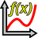
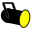
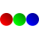

Q Light Controller Plus (QLC+ en abrégé) est conçu pour contrôler des équipements d'éclairage utilisés dans diverses représentations, comme les concerts en direct et le théâtre, etc. L'objectif principal est que QLC+ puisse surpasser les consoles d'éclairage commerciales sans nécessiter un manuel de plus de 500 pages, grâce à une interface utilisateur intuitive et flexible.

Cette page a été organisée par ordre alphabétique afin de faciliter la recherche d'un sujet particulier.

###  Audio

Une [fonction](#functions) audio est un objet représentant un fichier audio stocké sur un disque.  
QLC+ prend en charge les formats audio les plus courants comme Wave, MP3, M4A, Ogg et Flac. Il prend en charge les canaux mono ou stéréo et plusieurs fréquences d'échantillonnage comme 44,1KHz, 48KHz, etc...  
Les fonctions Audio peuvent être placées dans un [Chaser](#chaser) ou dans un [Show](#show) au moment souhaité, à l'aide du panneau [Show Manager](/show-manager).  
Comme la plupart des fonctions de QLC+, Audio prend en charge les temps de fade in et de fade out.

###  Blackout

Blackout est une fonction spéciale de QLC+ utilisée pour mettre à zéro tous les canaux [HTP](#htp-highest-takes-precedence) dans tous les univers. Cela aura pour effet d'arrêter l'émission de lumière de tous les fixtures. Les canaux resteront à zéro, indépendamment des fonctions en cours d'exécution ou des valeurs qui leur sont assignées manuellement (depuis le [Simple Desk](/simple-desk) par exemple). Lorsque le Blackout est désactivé, tous les canaux redeviennent contrôlés par les fonctions ou leur valeur définie manuellement.

### Capabilities

Certains canaux dans les fixtures intelligents fournissent de nombreux types de fonctions, ou _capabilities_, comme allumer la lampe lorsque la valeur du canal est \[240-255\], définir une couleur rouge sur une roue de couleurs lorsque la valeur est exactement \[15\], ou simplement contrôler l'intensité du dimmer du fixture avec des valeurs \[0-255\]. Chacune de ces fonctions individuelles est appelée une capability et chacune d'elles possède ces trois propriétés :

*   Valeur minimale : La valeur minimale du canal qui fournit une capability.
*   Valeur maximale : La valeur maximale du canal qui fournit une capability.
*   Nom : Le nom convivial d'une capability
*   Preset : Une fonctionnalité prédéfinie permettant à QLC+ de reconnaître précisément comment traiter et simuler une valeur de canal

###  Chaser

Une [fonction](#functions) Chaser est constituée de plusieurs scènes exécutées en séquence, l'une après l'autre, lorsque la fonction chaser est démarrée. La fonction suivante n'est exécutée qu'une fois la précédente terminée. Un nombre illimité de [fonctions](#functions) peut être inséré dans un chaser.

La direction de la fonction Chaser peut être inversée ou la sélection des scènes peut être aléatoire. La fonction Chaser peut également être configurée pour effectuer une boucle infinie, une boucle ping-pong infinie (la direction s'inverse après chaque passage) ou elle peut s'exécuter une seule fois, en mode single-shot, après quoi elle se termine d'elle-même. Si la fonction est configurée pour boucler indéfiniment, elle doit être arrêtée manuellement.

Chaque Chaser possède ses propres réglages de vitesse :

*   **Fade In :** La vitesse de fondu d'entrée d'un step
*   **Hold :** Le temps de maintien d'un step
*   **Fade Out :** La vitesse de fondu de sortie d'un step
*   **Duration :** La durée d'un step

Des copies des fonctions chaser peuvent être créées avec le [Function Manager](/function-manager). Les scènes contenues dans un chaser ne sont pas dupliquées lors de la copie d'un chaser. Seuls l'ordre et la direction sont copiés dans le nouveau.

### Click And Go

Click And Go est une technologie qui permet à l'utilisateur d'accéder rapidement à des macros et des couleurs de manière totalement visuelle et en quelques clics seulement. Cela peut conduire à des spectacles en direct plus efficaces et à plus de liberté pour choisir facilement le résultat souhaité.  
Trois types de widgets sont disponibles jusqu'à présent :

*   Couleur unique (s'applique aux canaux d'intensité Rouge, Vert, Bleu, Cyan, Jaune, Magenta, Ambre et Blanc)
*   Sélecteur de couleur RGB. Contrôle les valeurs des canaux RGB sélectionnés en un seul clic
*   Sélecteur Gobo/Macro. Accède et affiche un Gobo/Macro défini dans la définition du fixture

Un aperçu avec des captures d'écran est disponible [ici](https://www.qlcplus.org/old/clickandgo.html)

###  Collection

Une [fonction](#functions) Collection encapsule plusieurs fonctions qui sont exécutées simultanément lorsque la fonction collection est exécutée. Un nombre illimité de fonctions peut être inséré dans une collection, mais chaque fonction ne peut être insérée qu'une seule fois et une collection ne peut pas être membre direct d'elle-même.

Les collections n'ont pas de réglages de vitesse. La vitesse de chaque fonction membre est réglée individuellement à l'aide de leurs propres éditeurs.

Des copies des fonctions collection peuvent être créées avec le [Function Manager](/function-manager). Les fonctions contenues dans une collection ne sont pas dupliquées ; seule la liste des fonctions est copiée.

### DMX

[DMX](https://fr.wikipedia.org/wiki/DMX512) est l'abréviation de Digital MultipleX. Il définit fondamentalement tout un ensemble de propriétés, de protocole, de câblage, etc. Dans le cas d'un logiciel d'éclairage, il définit le nombre maximal de canaux (512) par univers et la plage de valeurs de chaque canal (0-255).

QLC+ prend en charge un nombre illimité d'univers (il y en a 4 au départ, mais d'autres peuvent être ajoutés si nécessaire). Ils n'ont pas nécessairement besoin d'être connectés à du matériel DMX. L'abstraction matérielle réelle (qu'il s'agisse d'analogique 0-10V, DMX ou d'une autre méthode) est réalisée par le biais des [plugins de sortie](#input-output-plugins).

###  EFX

Une [fonction](#functions) EFX est principalement utilisée pour automatiser les lyres et lumières mobiles (par ex. scanners et lyres), bien qu'elle puisse également automatiser les valeurs RGB ou Dimmer de lumières non mobiles. L'EFX peut créer des trajectoires mathématiques complexes sur un plan X-Y qui sont converties en valeurs DMX pour les canaux pan et tilt, ou RGB ou Dimmer du fixture.

###  Fixtures

Un fixture est essentiellement un appareil d'éclairage. Il peut s'agir, par exemple, d'une lyre, d'un scanner, d'un laser, etc. Cependant, par souci de simplicité, des PAR individuels (et similaires) qui sont généralement contrôlés via un canal dimmer par unité peuvent être regroupés pour former un seul fixture.

Avec le Fixture Definition Editor, les utilisateurs peuvent modifier les informations partagées des fixtures stockées dans une bibliothèque de fixtures qui contient les propriétés suivantes pour chaque fixture :

*   Fabricant (par ex. ClayPaky)
*   Modèle (par ex. MAC250)
*   Type (Color Changer, Scanner, Moving Head, Smoke, Haze, Fan...)
*   Propriétés physiques (type de lampe, angle du faisceau, dimensions...)
*   Canaux :
    *   Groupe de canal (Intensity, Pan, Tilt, Gobo, Color, Speed etc.)
    *   Associations de canaux 8 bits et 16 bits pour les groupes pan et tilt
    *   Couleur primaire optionnelle pour les canaux d'intensité (RGB/CMY)
    *   Plages de valeurs pour les fonctionnalités de canal (par ex. 0-5:Lamp on, 6-15:Strobe etc.)

Ces définitions de fixtures peuvent ensuite être utilisées pour créer des fixtures réels dans l'application Q Light Controller Plus, qui auront des propriétés supplémentaires définies par les utilisateurs :

*   Univers DMX
*   Adresse DMX
*   Nom

Plusieurs instances d'un fixture peuvent être créées (par ex. les utilisateurs doivent pouvoir avoir plusieurs instances d'un MAC250 en cours d'utilisation). Chaque fixture peut être nommé, mais le nom n'est pas utilisé en interne par QLC+ pour identifier les instances individuelles de fixtures. Il en va de même pour l'adresse DMX. Néanmoins, les utilisateurs sont encouragés à nommer leurs fixtures de manière systématique pour aider à identifier chacun d'eux -- si nécessaire.

Les appareils dimmer génériques n'ont pas besoin de leur propre définition de fixture, car généralement plusieurs dimmers sont patchés dans un espace d'adressage commun, en utilisant un ou plusieurs racks de dimmers. Les utilisateurs peuvent créer des instances de ces entités dimmer génériques simplement en définissant le nombre de canaux que chacune d'elles doit avoir.

###  Fixture Group

Un fixture group est, comme son nom l'indique, un groupe de [fixtures](#fixtures). Il définit également (à un niveau assez basique) la disposition physique réelle de ces fixtures dans le monde réel. Cette information peut être utilisée, par exemple, dans la RGB Matrix pour produire un mur de lumières mélangeables en RGB pouvant agir comme des pixels individuels dans un motif graphique ou un texte défilant.

### Fixture Mode

De nombreux fabricants conçoivent leurs appareils intelligents de manière à ce qu'ils puissent être configurés pour comprendre différents ensembles de canaux. Par exemple, un scanner peut avoir deux options de configuration : une pour des canaux de mouvement en 8 bits uniquement (1x pan, 1x tilt) et une autre pour des canaux de mouvement en 16 bits (2x pan, 2x tilt). Plutôt que de créer une définition de fixture entièrement nouvelle pour chaque variante, celles-ci ont été regroupées dans les définitions de fixtures de QLC+ en fixture modes. D'autres consoles ou formats appellent cela « personality ».

###  Functions

Le nombre de fonctions est pratiquement illimité. Les fonctions sont utilisées pour automatiser l'attribution de valeurs aux canaux DMX. Chaque type de fonction a sa propre manière d'automatiser les lumières.

Les types de fonctions sont :

*   [Scene](#scene)
*   [Chaser](#chaser)
*   [Sequence](#sequence)
*   [EFX](#efx)
*   [RGB Matrix](#rgb-matrix)
*   [Collection](#collection)
*   [Show](#show)
*   [Audio](#audio)
*   [Video](#video)

Chaque fonction peut être nommée et, bien que le nom ne soit pas utilisé pour identifier de manière unique les fonctions individuelles, les utilisateurs sont encouragés à nommer leurs fonctions de manière systématique et concise pour aider à identifier chacune d'elles. Pour votre propre confort.

Chaque fonction possède ses propres réglages de vitesse :

*   **Fade In :** Le temps utilisé pour faire fondre les canaux HTP (dans les Scenes également les canaux LTP) vers leur valeur cible
*   **Fade Out :** Le temps utilisé pour faire revenir en fondu les canaux HTP/intensity à zéro
*   **Duration :** La durée du step en cours (non applicable aux Scenes)

### Grand Master

Le Grand Master est utilisé comme slider maître final avant que les valeurs ne soient écrites sur le matériel DMX physique réel. Habituellement, le Grand Master n'affecte que les canaux **Intensity**, mais peut également être modifié pour affecter les valeurs de **tous** les canaux.

Le Grand Master dispose également de deux **Value Modes** qui contrôlent la manière dont le Grand Master affecte les valeurs des canaux :

*   Reduce : Les valeurs des canaux affectés sont réduites d'un pourcentage défini avec le slider du Grand Master. Par exemple, un Grand Master à 50% entraînera la réduction de tous les canaux affectés à 50% de leurs valeurs **actuelles**.
*   Limit : Les canaux affectés ne peuvent pas obtenir de valeurs supérieures à celle définie avec le slider du Grand Master. Par exemple, un Grand Master à 127 entraînera la limitation des valeurs maximales de tous les canaux affectés à exactement 127.

### Head

Un head représente un dispositif individuel d'émission de lumière dans un fixture. Habituellement, un seul fixture contient exactement une sortie, comme la lentille, l'ampoule ou un ensemble de LED. Il existe cependant un nombre croissant de fixtures sur le marché qui, bien que traités comme un seul fixture, possèdent plusieurs dispositifs d'émission de lumière, c'est-à-dire des heads.

Par exemple, vous pourriez avoir un fixture de type barre LED RGB assemblé sur un seul châssis et qui apparaît donc comme un seul fixture avec une entrée DMX et une sortie DMX. Cependant, il est en réalité composé de quatre « fixtures » LED RGB distincts. Ces fixtures distincts sont traités dans QLC+ comme des heads ; ils partagent certaines propriétés avec leurs heads frères, ils peuvent être contrôlés individuellement, mais ils peuvent également disposer d'un contrôle d'intensité maître qui contrôle l'émission de lumière de tous les heads ensemble.

Chaque head appartient à un [Fixture Mode](#fixture-mode) car dans un mode, un fixture peut fournir suffisamment de canaux pour contrôler individuellement chacun de ses heads, tandis que dans un autre mode, seule une poignée de canaux peut être fournie pour contrôler tous les heads simultanément.

### HTP (Highest Takes Precedence)

HTP est une règle qui détermine quel niveau est envoyé à un univers DMX par un canal lorsque ce canal est contrôlé par plus d'une [fonction](#functions) ou d'un widget de la Virtual Console. Généralement, les canaux d'intensité obéissent à la règle HTP. Cela inclut les canaux d'intensité génériques utilisés pour contrôler l'_intensité lumineuse_ avec des dimmers ainsi que les canaux contrôlant l'intensité d'une couleur, typiquement dans un fixture à LED.

La règle HTP est simple : le niveau le plus élevé (le plus proche de 100%) actuellement envoyé à un canal est celui qui est envoyé à l'univers DMX.

Supposons que vous ayez deux sliders qui contrôlent le même canal d'intensité. D'abord, vous réglez le slider 1 à 50%, puis vous déplacez le slider 2 de 0% à 75%. Tant que le slider 2 est en dessous de 50%, rien ne se passe, mais après avoir dépassé le niveau de 50% défini par le slider 1, l'intensité lumineuse augmente jusqu'à 75%. Si vous ramenez le slider 2 vers 0%, l'intensité lumineuse diminue jusqu'à atteindre les 50% définis par le slider 1 et reste à 50% jusqu'à ce que le slider 1 soit déplacé vers le bas.

Un fondu enchaîné entre 2 [Scenes](#scene) remplacera les niveaux HTP de la première scène par les niveaux HTP de la seconde. Les nouveaux niveaux HTP seront combinés avec les niveaux HTP d'autres fonctions et widgets de la virtual console comme décrit ci-dessus. Voir aussi [LTP](#ltp-latest-takes-precedence).

###  Input/Output plugins

QLC+ prend en charge une variété de plugins pour envoyer et recevoir des données depuis/vers le monde extérieur.  
Un plugin peut être une interface vers des dispositifs physiques (comme des adaptateurs DMX ou des contrôleurs MIDI) ou vers un protocole réseau (comme [Art-Net](/plugins/art-net), [OSC](/plugins/osc) ou [E1.31](/plugins/e1-31-sacn)).  
Les plugins prennent en charge des capacités d'input, d'output ou de feedback selon le dispositif ou le protocole qu'ils contrôlent.

Les principales méthodes d'input pour QLC+ sont naturellement le clavier et la souris. Les utilisateurs peuvent assigner des touches du clavier à des boutons de la virtual console et faire glisser des sliders et faire pratiquement tout avec une souris.

Cependant, avec les plugins, il est possible de connecter des dispositifs d'input supplémentaires à son ordinateur pour pallier l'expérience utilisateur plutôt maladroite et lente obtenue avec une souris et un clavier classiques. Les plugins prenant en charge une input line offrent la capacité de faire produire par des dispositifs externes des données d'input vers divers éléments de QLC+.

Une input line est une connexion fournie par du matériel ou un réseau, accessible via un plugin d'input. Il peut s'agir, par exemple, d'un connecteur MIDI IN sur l'ordinateur de l'utilisateur (ou un périphérique) auquel les utilisateurs peuvent connecter des dispositifs d'input compatibles MIDI comme des slider boards, etc.

Une output line est une connexion fournie par du matériel ou un réseau, accessible via un plugin d'output. En d'autres termes, il s'agit d'un véritable univers DMX, mais qui a été nommé output pour le distinguer des univers internes de QLC+. Vous pouvez les considérer comme des connecteurs de sortie XLR individuels sur votre matériel DMX.

### Input profiles

Les input profiles peuvent être considérés comme les cousins des [fixtures](#fixtures) ; ils contiennent des informations sur des dispositifs spécifiques qui produisent des données d'input. Un dispositif d'input peut être, par exemple, une slider board comme la Behringer BCF-2000, la KORG nanoKONTROL, un Enttec Playback Wing...

### LTP (Latest Takes Precedence)

LTP est une règle qui détermine quel niveau est envoyé à un univers DMX par un canal lorsque ce canal est contrôlé par plus d'une [fonction](#functions) ou d'un widget de la Virtual Console. Généralement, elle est utilisée pour les canaux qui ont été assignés à des groupes autres que le groupe **Intensity**, tels que pan, tilt, gobo, vitesse de strobe et autres _paramètres de fixtures intelligents_

La règle LTP est simple : le dernier niveau qui a été défini par une fonction ou un widget de la Virtual Console est envoyé à l'univers DMX.

Lors d'un fondu enchaîné entre [Scenes](#scene), les niveaux LTP sont souvent modifiés. Cela doit être géré avec une certaine prudence car certains niveaux LTP doivent basculer immédiatement vers un nouveau niveau, par exemple lors du changement d'un gobo à un autre. Les groupes LTP tels que pan et tilt peuvent toutefois avoir besoin de changer progressivement d'un niveau à un autre pendant un fondu enchaîné. Différents timings peuvent être obtenus en combinant des scènes dans une [Collection](#collection). Voir aussi [HTP](#htp-highest-takes-precedence).

###  Palette

Une Palette est une entité dans QLC+ représentant une caractéristique de fixture. Par exemple, une Palette peut être une couleur, une position, un angle de zoom, etc.
Les Palettes peuvent être utilisées dans les [Scenes](#scene) pour abstraire une caractéristique indépendamment des Fixtures contrôlés par la Scene.

###  RGB Matrix

Une [fonction](#functions) RGB Matrix peut être utilisée pour imposer des graphiques simples et du texte sur une matrice (une grille ou un mur) de [heads](#head) de fixtures RGB et/ou monochromes. La fonction RGB Matrix a été conçue pour être extensible avec des [scripts](#rgb-script) pouvant être écrits par les utilisateurs.

Chaque RGB Matrix possède ses propres réglages de vitesse :

*   **Fade In :** Temps pour faire apparaître en fondu chaque pixel
*   **Fade Out :** Temps pour faire disparaître en fondu chaque pixel
*   **Duration :** La durée du step/frame en cours

###  RGB Script

Un RGB script est un programme écrit en [ECMAScript](https://fr.wikipedia.org/wiki/ECMAScript) (également connu sous le nom de JavaScript) qui produit les données d'image nécessaires aux fonctions [RGB Matrix](#rgb-matrix). Pour en savoir plus, consultez la page [RGB Script API](/function-manager/rgb-script-api).

###  Scene

Une [fonction](#functions) Scene comprend les valeurs des canaux sélectionnés contenus dans une ou plusieurs instances de fixture. Lorsqu'une scène est démarrée, le temps nécessaire à ses canaux pour atteindre leurs valeurs cibles dépend des réglages de vitesse de la scène :

Chaque fonction possède ses propres réglages de vitesse :

*   **Fade In :** Le temps utilisé pour faire fondre tous les canaux vers leurs valeurs cibles, à partir de la valeur qu'ils avaient
*   **Fade Out :** Le temps utilisé pour faire revenir en fondu les canaux HTP/intensity à zéro. Notez que SEULS les canaux [HTP](#htp-highest-takes-precedence) sont affectés par ce réglage.

Des copies des fonctions scene peuvent être créées avec le [Function Manager](/function-manager). Tout le contenu de la scène est copié dans le duplicata.

###  Sequence

Une Sequence possède certaines des fonctionnalités d'un [Chaser](#chaser).  
Elle équivaut à un Chaser dans lequel chaque step est une unique [Scene](#scene) et chacune de ces Scenes contrôle le même ensemble de canaux. Une Sequence est liée à une Scene spécifique, ce qui signifie que tous les steps de la Sequence ne peuvent contrôler que les canaux activés de cette Scene.  
Lors de la création de nouveaux steps dans une Sequence, aucune fenêtre de sélection de fonction n'apparaîtra, car un step de Sequence ne peut pas inclure d'autres fonctions, contrairement à un step de Chaser.  
Lorsqu'une Sequence est créée, une icône de séquence spéciale apparaît dans le [Function Manager](/function-manager) en tant qu'enfant de la Scene à laquelle elle est liée.  
Pour comprendre la différence entre une Sequence et un Chaser, vous êtes invités à lire le deuxième paragraphe de la documentation du [Show Manager](/show-manager).

###  Script

La [fonction](#functions) Script repose sur un langage de script simple mais puissant permettant d'automatiser les fonctionnalités de QLC+ de manière séquentielle. Un Script peut être modifié avec le [Script Editor](/function-manager/script-editor).

###  Show

Un Show est une [fonction](#functions) avancée qui encapsule la plupart des fonctions de QLC+ pour créer un spectacle lumineux piloté dans le temps. Un Show ne peut être créé qu'avec le [Show Manager](/show-manager) et peut être inspecté et renommé avec le [Show Editor](/function-manager/show-editor).

###  Video

Une [fonction](#functions) video est un objet représentant un fichier vidéo stocké sur un disque ou une URL réseau.  
Les formats vidéo pris en charge dépendent de votre système d'exploitation. Par exemple, Mac OSX est limité aux fichiers MOV/MP4 et guère plus.  
Les fonctions Video peuvent être placées dans un [Chaser](#chaser) ou dans un [Show](#show) au moment souhaité, à l'aide du panneau [Show Manager](/show-manager).
