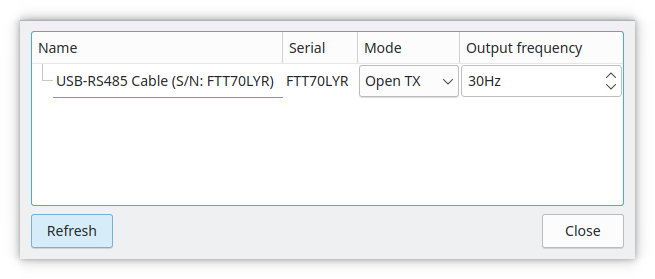

Auf dieser Seite finden Sie die häufigsten Fragen, die Ihnen beim Einstieg in QLC+ in den Sinn kommen könnten.  
Hier finden Sie entweder direkt die Antwort oder Hilfe, die Ihnen den richtigen Weg weist.
 

#### Frage #1: QLC+ findet mein USB Dongle nicht.

**A:** QLC+ unterstützt sehr viele Arten von USB-DMX adaptern. Stelle bitte zuerst fest, dass die Verbindung richtig besteht. Im Regelfall wird die Aktivität des Adapters auch 
über eine Status LED signalisiert.

Wenn Sie Windows benutzen und der Adapter von Peperoni oder Vellemann ist, lesen Sie bitte die Anleitung auf deren Hilfeseiten wie die Adapter einzurichten sind.
Bei Lizenzroblemen benötigen beide separate DLL Dateien um ordnungsgemäß zu arbeiten.
Bitte überprüfen Sie [Peperoni output plugin](/plugins/peperoni) oder [Velleman output plugin](/plugins/velleman)

Wenn Sie Linux benutzen, stellen sie sicher, dass die Distribution Ihren Adapter richtig erkennt wenn dieser eingesteckt ist. Normalerweise sollte das `dmesg` Kommando etwas anzeigen.

#### Frage #2: Ich habe mehrere [Schaltflächen](/virtual-console/button) in meiner virtuellen Konsole. Ich brauche eine Möglichkeit, die aktuell aktive Schaltfläche zu deaktivieren, wenn ich eine andere aktiviere. Wie mache ich das?

**A:** Platzieren Sie Ihre Tasten einfach in einem [Solo Frame](/virtual-console/solo-frame). Nun sollte das Problem gelöst sein.

#### Frage #3: Ich habe gerade meinen Mac auf Mavericks (oder höher) aktualisiert und mein USB-DMX-Adapter überträgt keine Daten.

**A:** Das Problem liegt in einem Apple-Treiber namens AppleUSBFTDI, der die Kontrolle über jedes FTDI-basierte Gerät übernimmt.

Es gibt mehrere Möglichkeiten das Problem zu lösen, aber im Grunde ist das Ergebnis dasselbe: Der Apple-Treiber muss deaktiviert werden.

Bitte schauen Sie auf der entsprechenden Seite nach um zu erfahren wie Sie [den Apple FTDI-Treiber deaktivieren](/plugins/disable-apple-serial-vcp-driver)

Andernfalls können Sie das [ENTTEC FTDI Driver Control Tool] herunterladen (https://www.dmxis.com/release/FtdiDriverControl.zip).
Versuchen Sie den Apple-Treiber damit zu aktivieren/deaktivieren.

**Notiz 1: Dies kann das Verhalten anderer USB-Geräte beeinträchtigen. Tun Sie es also nur, wenn Sie wissen was Sie tun!**

**Notiz 2: Jedes Mal, wenn Mac OS ein Update erhält, müssen Sie diesen Vorgang erneut durchführen!**

**Notiz 3: Wenn Sie den Apple-Treiber deaktivieren/aktivieren, müssen Sie höchstwahrscheinlich Ihren Mac neu starten**

#### Frage #4: Wo ist der QLC+ Benutzerordner in meinem System zu finden?

**A:** Im Benutzerordner befinden sich Benutzergeräte, Eingabeprofile, RGB-Skripte und MIDI-Vorlagen.

Es ändert sich je nach Betriebssystem:

* **Linux**: Es handelt sich um einen versteckten Ordner in Ihrem Benutzer-Home-Verzeichnis: `$HOME/.qlcplus`
* **Windows**: Es handelt sich um einen Ordner in Ihrem Benutzerverzeichnis (z. B. <Benutzername>): `C:\\Users\\<Username>\\QLC+`
* **Mac OS**: Es befindet sich in Ihrem Benutzerverzeichnis „Bibliothek“: `$HOME/Library/Application\\ Support/QLC+`

Sie können jeden dieser Ordner von einem Terminal aus mit dem Befehl „cd“ erreichen. Zum Beispiel:

`cd $HOME/Library/Application\\ Support/QLC+`

Bitte beachten Sie, dass im Benutzerordner gefundene Geräte und Eingabeprofile Vorrang haben
die gleichen Dateien im QLC+-Systemordner. 

Sie können auch benutzerdefinierte [Fixture-Definitionen] (/basics/glossary-and-concepts#fixtures) und speichern
[Eingabeprofile](/input-output/input-profiles) im selben Ordner wie Ihr Projekt, findet QLC+
sie, wenn Sie das Projekt öffnen.

#### Frage #5: Wo befindet sich der QLC+-Systemordner in meinem System?

**A:** Im Systemordner werden QLC+-Ressourcen (Geräte, Eingabeprofile, RGB-Skripte usw.) installiert
und es ändert sich je nach Betriebssystem:

* **Linux**: ein immer gleicher Ordner: `/usr/share/qlcplus`
* **Windows**: Es ist der Ordner, in dem Sie QLC+ installiert haben. Standartmäßig: `C:\\QLC+`
* **Mac OS**: Es handelt sich um einen Ordner im QLC+-Bundle (.app-Datei). Es ist möglich zu stöbern
  Die QLC+ .app-Bundle-Inhalte einfach mit Finder. Klicken Sie einfach mit der rechten Maustaste auf die Datei und wählen Sie sie aus
  „Paketinhalt anzeigen“. Andernfalls ist der Systemordner über ein Terminal erreichbar
  aber es hängt davon ab, wo Sie QLC+ installiert haben. Zum Beispiel, wenn Sie QLC+ hineingezogen haben
  Anwendungen lauten: „/Applications/QLC+.app/Contents/Resources“.

#### Question #6: QLC+ kann in Windws manche Videos nicht abspielen.

**A:** QLC+ basiert auf den Qt-Bibliotheken, die auf den im System installierten DirectShow-Filtern basieren.

Leider sind die von Windows unterstützten grundlegenden Codecs ziemlich dürftig, sodass Sie einige zusätzliche installieren müssen
Codecs-Paket wie K-Lite, [available here](https://www.codecguide.com/download_kl.htm).

#### Question #7: Ich habe ein 4K-Display und alles in der QLC+-Schnittstelle ist extrem klein

**A:** Sie müssen der QLC+-Befehlszeile eine Option hinzufügen, um die Qt-Bibliotheken anzuweisen, automatisch zu skalieren
die Schnittstelle auf einem High-DPI-Display. Beispiele:

* **Linux (from terminal)**: `QT_AUTO_SCREEN_SCALE_FACTOR=1 qlcplus`
* **Windows shortcut**: `C:\\Windows\\System32\\cmd.exe /c "SET QT_AUTO_SCREEN_SCALE_FACTOR=1 && START /D ^"C:\\QLC+^" qlcplus.exe"`
* **Mac OS (from terminal)**: `QT_AUTO_SCREEN_SCALE_FACTOR=1 QLC+.app\\Contents\\MacOS\\qlcplus`

Im Falle, schaue nach den [command line parameters page](/advanced/command-line-parameters) für weitere Informationen.

#### Question #8: Meine Lichteffekte flackern, was kann ich tun?

**A:** Manchmal kann ein ungepufferter USB-DMX-Adapter oder eine verrauschte DMX-Leitung dazu führen, dass einige Geräte Probleme haben
und flackern unerwartet. Mit QLC+ können Sie die Ausgangsfrequenz anpassen, um den unerwünschten Effekt abzuschwächen.
Bitte beachten Sie, dass eine gute DMX-Bildwiederholfrequenz bei etwa 44 Hz liegen sollte. Hier ist ein Beispiel, das eine zeigt:
Öffnen Sie das DMX-Klon-Einstellungsfeld. Sie können darauf zugreifen, indem Sie auf die Ausgabezeile doppelklicken oder auswählen
eine Ausgabezeile und klicken Sie auf das Symbol .

