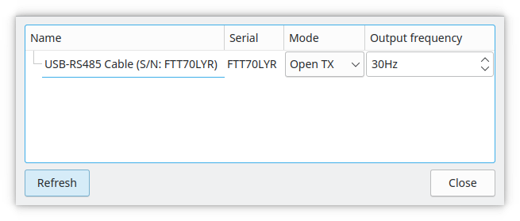

En aquesta pàgina trobaràs les preguntes freqüents que et poden venir al cap quan comences amb QLC+.  
Aquí pots trobar la resposta directament o trobar ajuda per orientar-te en la direcció correcta.  

#### Pregunta #1: QLC+ no pot detectar el meu dispositiu USB

**R:** QLC+ admet una àmplia varietat de dispositius USB. Primer de tot hauries de comprovar si la 
connexió física és correcta. Normalment, un LED del dispositiu hauria d'indicar si està encès i funciona correctament.

Si utilitzes Windows i el teu dispositiu està fabricat per Peperoni o Velleman, llegeix la 
informació sobre com fer-los funcionar en aquestes pàgines d'ajuda. Per motius de llicència, tots dos necessiten un fitxer
DLL addicional per funcionar. Consulta el [connector de sortida Peperoni](/plugins/peperoni) o el [connector de sortida Velleman](/plugins/velleman)

Si utilitzes Linux, comprova si la teva distribució ha detectat el dispositiu en connectar-lo. Bàsicament,
l'ordre `dmesg` t'hauria de dir alguna cosa.

#### Pregunta #2: Tinc diversos [botons](/virtual-console/button) a la meva Virtual Console. Necessito una manera de desactivar el botó actualment actiu quan n'activo un altre. Com ho puc fer?

**R:** Simplement col·loca els teus botons dins d'un [Solo Frame](/virtual-console/solo-frame). Fa exactament això.

#### Pregunta #3: Acabo d'actualitzar el meu Mac a Mavericks (o posterior) i el meu adaptador USB DMX no transmet cap dada.

**R:** El problema és en un controlador d'Apple anomenat AppleUSBFTDI, que pren el control de qualsevol
dispositiu basat en FTDI detectat al sistema.

Hi ha diverses maneres de resoldre el problema, però bàsicament el resultat és el mateix: cal desactivar el controlador d'Apple.

Consulta la pàgina dedicada per entendre com [desactivar el controlador Apple FTDI](/plugins/disable-apple-serial-vcp-driver)

En cas contrari, pots descarregar l'eina [ENTTEC FTDI Driver Control](https://www.dmxis.com/release/FtdiDriverControl.zip)
i provar d'activar/desactivar el controlador d'Apple amb ella.

**Nota 1: això pot comprometre el comportament d'altres dispositius USB, així que fes-ho només si saps què estàs fent!**

**Nota 2: cada vegada que Mac OS rep una actualització, has de tornar a fer aquest procediment!**

**Nota 3: el més probable és que, quan desactivis/activis el controlador d'Apple, hagis de reiniciar el teu Mac**

#### Pregunta #4: On es troba la carpeta d'usuari de QLC+ al meu sistema?

**R:** La carpeta d'usuari és on van els fixtures d'usuari, els perfils d'entrada, els scripts RGB i les plantilles MIDI.

Canvia segons el teu sistema operatiu:

* **Linux**: és una carpeta oculta al directori d'inici del teu usuari: `$HOME/.qlcplus`
* **Windows**: és una carpeta al teu directori d'usuari (p. ex. <Username>): `C:\\Users\\<Username>\\QLC+`
* **Mac OS**: es troba al directori `Library` del teu usuari: `$HOME/Library/Application\\ Support/QLC+`

Pots accedir a qualsevol d'aquestes carpetes des d'un terminal amb l'ordre `cd`. Per exemple:

`cd $HOME/Library/Application\\ Support/QLC+`

Tingues en compte que els fixtures i els perfils d'entrada que es trobin a la carpeta d'usuari tindran precedència sobre
els mateixos fitxers a la carpeta de sistema de QLC+. 

També pots desar [Definicions de Fixture](/basics/glossary-and-concepts#fixtures) personalitzades i
[Perfils d'Entrada](/input-output/input-profiles) a la mateixa carpeta que el teu projecte; QLC+ els trobarà
quan obris aquest projecte.

#### Pregunta #5: On es troba la carpeta de sistema de QLC+ al meu sistema?

**R:** La carpeta de sistema és on s'instal·len els recursos de QLC+ (fixtures, perfils d'entrada, scripts RGB, etc.)
i canvia segons el teu sistema operatiu:

* **Linux**: és una carpeta fixa anomenada `/usr/share/qlcplus`
* **Windows**: és la carpeta on realment has instal·lat QLC+. Per defecte: `C:\\QLC+`
* **Mac OS**: és una carpeta dins del paquet de QLC+ (fitxer .app). És possible explorar
  el contingut del paquet QLC+.app simplement amb el Finder. Només cal fer clic amb el botó dret al fitxer i seleccionar
  "Show Package Contents". En cas contrari, es pot accedir a la carpeta de sistema amb un terminal
  però depèn d'on hagis instal·lat QLC+. Per exemple, si has arrossegat QLC+ a
  Aplicacions, serà: `/Applications/QLC+.app/Contents/Resources`

#### Pregunta #6: QLC+ no pot reproduir alguns vídeos a Windows

**R:** QLC+ depèn de les biblioteques Qt, que al seu torn depenen dels filtres DirectShow instal·lats al sistema.

Malauradament, els còdecs bàsics admesos per Windows són bastant pobres, per la qual cosa cal instal·lar algun
paquet de còdecs addicional com K-Lite, [disponible aquí](https://www.codecguide.com/download_kl.htm).

#### Pregunta #7: Tinc una pantalla 4k i tot a la interfície de QLC+ es veu extremadament petit

**R:** Has d'afegir una opció a la línia d'ordres de QLC+ per indicar a les biblioteques Qt que escalin
automàticament la interfície en una pantalla d'alta densitat (High DPI). Exemples:

* **Linux (des del terminal)**: `QT_AUTO_SCREEN_SCALE_FACTOR=1 qlcplus`
* **Drecera de Windows**: `C:\\Windows\\System32\\cmd.exe /c "SET QT_AUTO_SCREEN_SCALE_FACTOR=1 && START /D ^"C:\\QLC+^" qlcplus.exe"`
* **Mac OS (des del terminal)**: `QT_AUTO_SCREEN_SCALE_FACTOR=1 QLC+.app\\Contents\\MacOS\\qlcplus`

En qualsevol cas, consulta la pàgina de [paràmetres de línia d'ordres](/advanced/command-line-parameters) per a més informació.

#### Pregunta #8: Les meves llums parpellegen. Què puc fer?

**R:** De vegades, un adaptador USB DMX sense memòria intermèdia o una línia DMX amb soroll poden fer que
alguns fixtures parpellegin de manera inesperada. QLC+ et permet ajustar la freqüència de sortida per mitigar
l'efecte no desitjat. Tingues en compte que una bona freqüència de refresc DMX hauria de rondar els 44Hz. Aquí tens
un exemple que mostra el panell de configuració d'un clon d'Open DMX. Hi pots accedir fent doble clic
a la línia de sortida o seleccionant una línia de sortida i fent clic a la icona .

