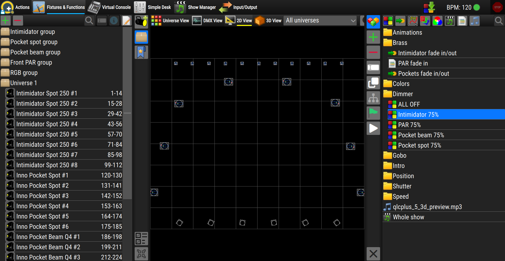

Le contexte **Fixtures et Fonctions** est l'espace de travail principal de l'interface utilisateur de la version 5.
C'est ici que vous ajoutez et disposez vos fixtures, contrôlez leurs canaux, organisez les palettes et les groupes de fixtures, et créez et modifiez des fonctions telles que Scenes, Chasers, EFX et Shows.

L'espace de travail est divisé en plusieurs zones :
* **Panneau gauche** — ajoute des fixtures, gère les groupes et palettes, et
  contrôle les canaux des fixtures sélectionnés.
* **Zone de vue principale** — affiche vos fixtures selon l'un des quatre modes
  (grille Universe, canaux DMX, plateau 2D ou plateau 3D).
* **Panneau droit** — crée, modifie et gère vos fonctions.
* **Panneau inférieur** — ouvre des éditeurs contextuels, comme la console
  de canaux de la Scene.

Les panneaux gauche et droit sont repliés par défaut. Cliquez sur l'un de leurs boutons pour faire glisser le panneau et l'ouvrir ; cliquez à nouveau sur le bouton actif pour le fermer. Vous pouvez également faire glisser le bord intérieur d'un panneau pour l'élargir ou le rétrécir.

---

## La vue principale

Le centre de l'écran affiche vos fixtures. Une barre d'outils en haut permet de
choisir entre quatre vues différentes de la même configuration. Une seule vue
est affichée à la fois.

| Vue | Ce qu'elle montre |
|------|---------------|
|  **Universe View** | Une grille d'adresses DMX pour l'univers sélectionné. Les fixtures occupent les canaux auxquels ils sont patchés. Vous pouvez faire glisser un fixture pour le déplacer vers une autre adresse, et couper-coller des fixtures. |
|  **DMX View** | Chaque fixture affiché sous forme de bande de ses canaux avec leurs valeurs en direct. Cliquez sur un canal pour ouvrir un slider ou un outil de preset et modifier directement sa valeur. |
|  **2D View** | Un plan de votre scène vu de dessus, avec chaque fixture dessiné à sa position réelle. Utile pour disposer un rig vu d'en haut. |
|  **3D View** | Un rendu tridimensionnel de la scène, incluant les faisceaux et les couleurs. (Si votre système ne prend pas en charge le rendu 3D, un avis s'affiche à la place.) |

### Choisir et détacher une vue

* **Clic gauche** sur un bouton de vue dans la barre d'outils pour basculer vers cette vue.
* **Clic droit** sur un bouton de vue pour **détacher** cette vue dans sa propre
  fenêtre séparée. Ceci est pratique sur des configurations multi-écrans — par
  exemple, gardez le plan 2D sur un écran et le rendu 3D sur un autre. Le
  bouton disparaît de la barre d'outils tant que sa vue est détachée ; fermez
  la fenêtre détachée pour la faire revenir.

### Outils de la barre d'outils de vue

À droite des boutons de vue, vous trouverez :

* **Sélecteur d'univers** — un menu déroulant pour choisir quel univers est
  affiché. Choisissez un seul univers pour vous concentrer dessus, masquant
  les fixtures patchés ailleurs.
* **Zoom arrière / Zoom avant** — rend les fixtures plus petits ou plus grands
  dans la vue actuelle.
* **Paramètres de vue** (le bouton « barres ») — affiche ou masque le panneau
  de paramètres pour la vue actuelle. Ce bouton n'apparaît que pour les vues
  qui ont leurs propres paramètres (les vues DMX et 2D).

---

## Panneau gauche — Fixtures et canaux

Le panneau gauche regroupe trois outils de gestion en haut, les outils de
contrôle des canaux au milieu, et les outils de sélection en bas.

### Gestion des fixtures

| Bouton | Ce qu'il fait |
|--------|--------------|
|  **Add Fixtures** | Ouvre le fixture browser. Recherchez dans la bibliothèque de fixtures et faites glisser un fixture dans la vue pour le patcher. (Disponible uniquement lorsque l'édition des fixtures est autorisée.) |
|  **Fixture Groups** | Crée et modifie des groupes de fixtures, afin de pouvoir sélectionner et contrôler plusieurs fixtures ensemble. |
|  **Palettes** | Crée et gère les palettes — des valeurs enregistrées pour la couleur, la position, le dimmer, etc. — que vous pouvez réutiliser dans vos fonctions. |

### Outils de contrôle des canaux

Ces outils vous permettent de contrôler directement les fixtures
**sélectionnés**. Chaque bouton ne devient actif que lorsqu'au moins un
fixture sélectionné possède réellement cette capacité ; le petit nombre sur
un bouton indique à combien des fixtures sélectionnés il s'applique. Cliquez
sur un bouton pour ouvrir son outil à côté du panneau.

| Outil | Ce qu'il contrôle |
|------|------------------|
|  **Intensity** | L'intensité dimmer / master des fixtures sélectionnés. |
|  **Shutter** | Les presets de shutter et de strobe (ouvert, fermé, strobe, pulse, …). |
|  **Position** | Pan et tilt — pour orienter les lyres et scanners. |
|  **Color** | La couleur des fixtures, en mélangeant le RGB (et blanc / ambre / UV lorsque disponibles). |
|  **Color Wheel** | Sélectionne une couleur sur la roue de couleurs fixe du fixture. |
|  **Gobos** | Sélectionne un gobo sur la roue de gobos du fixture. |
|  **Beam** | Les propriétés de faisceau telles que le zoom et le focus. |

### Outils de sélection (bas du panneau)

| Bouton | Ce qu'il fait |
|--------|--------------|
| <i class="fa fa-bolt fa-2x"></i> **Highlight** | Met temporairement en surbrillance les fixtures actuellement sélectionnés afin que vous puissiez voir lesquels ils sont. Le nombre indique combien de fixtures sont sélectionnés. |
| <i class="fa fa-crosshairs fa-2x"></i> **Pick a 3D point** | (Vue 3D uniquement) Permet de cliquer sur un point du plateau 3D pour y orienter les fixtures sélectionnés. Raccourci : **Ctrl+P**. |
|  **Toggle multiple selection** | Lorsqu'il est activé, cliquer sur des fixtures les ajoute à la sélection au lieu de la remplacer, ce qui permet de constituer une sélection de plusieurs fixtures. |
|  **Select / Deselect all** | Sélectionne tous les fixtures, ou efface la sélection si tout est déjà sélectionné. Raccourci : **Ctrl+A**. |

---

## Panneau droit — fonctions

Le panneau droit est l'endroit où vous travaillez avec les **fonctions** —
Scenes, Chasers, Sequences, EFX, RGB Matrices, Collections, Scripts, Audio,
Video et Shows.

| Bouton | Ce qu'il fait |
|--------|--------------|
|  **Function Manager** | Ouvre la liste de toutes vos fonctions, organisées en dossiers. Sélectionnez une fonction ici pour la modifier. |
| <i class="fa fa-stopwatch fa-2x" style="color:turquoise"></i>**Timing Settings** | (Uniquement dans le [Show Manager](/show-manager)) Ajuste les réglages de timing du show. |
| <i class="fa fa-plus fa-2x" style="color:limegreen"></i>**Add a new function** | Ouvre un menu permettant de créer une nouvelle fonction. Choisissez le type et son éditeur s'ouvre automatiquement. (Disponible uniquement lorsque l'édition des fonctions est autorisée.) |
| <i class="fa fa-minus fa-2x" style="color:crimson"></i>**Delete** | Supprime les fonctions et dossiers sélectionnés, après vous avoir demandé de confirmer. |
|  **Rename** | Renomme l'élément sélectionné. Lorsque plusieurs éléments sont sélectionnés, vous pouvez tous les renommer en une seule fois avec une numérotation automatique. |
| <i class="fa fa-clone fa-2x"></i>**Clone** | Crée une copie de chaque fonction sélectionnée. |
| <i class="fa fa-sitemap fa-2x"></i>**Show function usage** | Montre où la fonction sélectionnée est utilisée — quelles autres fonctions, widgets de virtual console, etc. la référencent. |
|  **Autostart** | Marque la fonction sélectionnée pour qu'elle démarre automatiquement au chargement du projet (ou retire cette marque). |
| <i class="fa fa-play fa-2x"></i>**Function Preview** | Exécute en direct la fonction sélectionnée afin de la prévisualiser. Cliquez à nouveau pour arrêter. |
|  **Toggle multiple selection** | (Uniquement dans le [Show Manager](/show-manager)) Permet de sélectionner plusieurs éléments à la fois. |
| <i class="fa fa-xmark fa-2x"></i>**Reset dump channels** | Efface les canaux actuellement capturés pour un dump dans une scène. Raccourci : **Ctrl+R**. |

### Créer une fonction

Lorsque vous choisissez un type dans le menu **Add a new function** :

* Les fonctions **Audio** et **Video** vous demandent d'abord de choisir le ou
  les fichiers multimédias. Si vous sélectionnez un seul fichier, son éditeur
  s'ouvre immédiatement ; si vous en sélectionnez plusieurs, une fonction est
  créée pour chacun et le Function Manager s'ouvre afin que vous puissiez les
  examiner.
* Un **Show** fait basculer l'application vers l'espace de travail **Show
  Manager**.
* Tout autre type crée la fonction et ouvre son éditeur dans le panneau droit,
  prêt à être modifié.

---

## Panneau inférieur

Le panneau inférieur est masqué jusqu'à ce qu'il soit nécessaire. Il glisse
depuis le bas de l'écran pour héberger des éditeurs qui fonctionnent aux
côtés de la vue principale — le plus souvent la **console de canaux de la
Scene**, où vous définissez les valeurs de canaux pour une scène.

| Bouton | Ce qu'il fait |
|----------|-------------------|
| <i class="fa fa-chevron-up fa-2x"></i> **Expand / Collapse** | ouvre le panneau à sa hauteur maximale ou le replie en une fine bande. Vous pouvez également faire glisser le bord supérieur du panneau vers le haut ou le bas pour définir la hauteur souhaitée |
| <i class="fa fa-copy fa-2x"></i> **Copy to fixtures of the same type** | (Console de Scene uniquement) copie les valeurs de canaux sélectionnées sur tous les autres fixtures du même type, afin de ne pas avoir à les définir un par un |
|  **Toggle multiple channel selection** | (Console de Scene uniquement) permet de sélectionner plusieurs canaux à la fois |

Pendant que le panneau inférieur est ouvert, il partage l'écran avec les vues
au-dessus de lui, qui se réduisent pour lui faire de la place.
