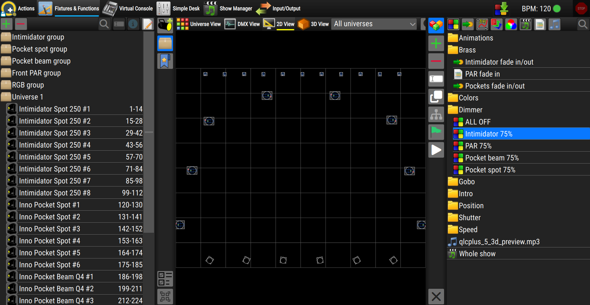

The **Fixtures and Functions** context is the main editing workspace of the version 5 UI. 
This is where you add and arrange your fixtures, control their channels, organise palettes and fixture groups, and create and edit functions such as Scenes, Chasers, EFX and Shows.

The workspace is divided into several areas:
* **Left panel** — add fixtures, manage groups and palettes, and control the
  channels of the selected fixtures.
* **Main view area** — shows your fixtures in one of four ways (Universe grid,
  DMX channels, 2D stage or 3D stage).
* **Right panel** — create, edit and manage your functions.
* **Bottom panel** — opens contextual editors, such as the Scene channel
  console.

The left and right panels are collapsed by default. Click one of their buttons to slide the panel open; click the active button again to close it. You can also drag the inner edge of a panel to make it wider or narrower.

---

## The main view

The centre of the screen shows your fixtures. A toolbar across the top lets you
choose between four different views of the same setup. Only one view is shown at
a time.

| View | What it shows |
|------|---------------|
|  **Universe View** | A grid of DMX addresses for the selected universe. Fixtures occupy the channels they are patched to. You can drag a fixture to move it to a different address, and cut and paste fixtures. |
|  **DMX View** | Each fixture shown as a strip of its channels with their live values. Click a channel to open a slider or preset tool and change its value directly. |
|  **2D View** | A top-down plan of your stage, with each fixture drawn at its real position. Useful for laying out a rig as seen from above. |
|  **3D View** | A three-dimensional rendering of the stage, including beams and colours. (If your system does not support 3D rendering, a notice is shown instead.) |

### Choosing and detaching a view

* **Left-click** a view button in the toolbar to switch to that view.
* **Right-click** a view button to **detach** that view into its own separate
  window. This is handy on multi-monitor setups — for example, keep the 2D plan
  on one screen and the 3D render on another. The button disappears from the
  toolbar while its view is detached; close the detached window to bring it
  back.

### View toolbar tools

To the right of the view buttons you'll find:

* **Universe selector** — a drop-down to choose which universe is shown. Pick a
  single universe to focus on it, hiding fixtures patched elsewhere.
* **Zoom out / Zoom in** — make the fixtures appear smaller or larger in the
  current view.
* **View settings** (the "bars" button) — shows or hides the settings panel for
  the current view. This button only appears for views that have their own
  settings (the DMX and 2D views).

---

## Left panel — Fixtures and channels

The left panel groups three management tools at the top, the channel control
tools in the middle, and the selection tools at the bottom.

### Managing fixtures

| Button | What it does |
|--------|--------------|
|  **Add Fixtures** | Opens the fixture browser. Search the fixture library and drag a fixture into the view to patch it. (Only available when fixture editing is permitted.) |
|  **Fixture Groups** | Create and edit groups of fixtures, so you can select and control several fixtures together. |
|  **Palettes** | Create and manage palettes — saved values for colour, position, dimmer, etc. — that you can reuse across your functions. |

### Channel control tools

These tools let you directly control the **selected** fixtures. Each button only
becomes active when at least one selected fixture actually has that capability;
the small number on a button tells you how many of the selected fixtures it
applies to. Click a button to open its tool next to the panel.

| Tool | What it controls |
|------|------------------|
|  **Intensity** | The dimmer / master intensity of the selected fixtures. |
|  **Shutter** | Shutter and strobe presets (open, closed, strobe, pulse, …). |
|  **Position** | Pan and tilt — point moving heads and scanners. |
|  **Color** | The colour of the fixtures, mixing RGB (and white / amber / UV where available). |
|  **Color Wheel** | Selects a colour from the fixture's fixed colour wheel. |
|  **Gobos** | Selects a gobo from the fixture's gobo wheel. |
|  **Beam** | Beam properties such as zoom and focus. |

### Selection tools (bottom of the panel)

| Button | What it does |
|--------|--------------|
| <i class="fa fa-bolt fa-2x"></i> **Highlight** | Temporarily highlights the currently selected fixtures so you can see which ones they are. The number shows how many fixtures are selected. |
| <i class="fa fa-crosshairs fa-2x"></i> **Pick a 3D point** | (3D view only) Lets you click a point in the 3D stage to aim the selected fixtures at it. Shortcut: **Ctrl+P**. |
|  **Toggle multiple selection** | When enabled, clicking fixtures adds them to the selection instead of replacing it, so you can build up a selection of several fixtures. |
|  **Select / Deselect all** | Selects every fixture, or clears the selection if everything is already selected. Shortcut: **Ctrl+A**. |

---

## Right panel — functions

The right panel is where you work with **functions** — Scenes, Chasers,
Sequences, EFX, RGB Matrices, Collections, Scripts, Audio, Video and Shows.

| Button | What it does |
|--------|--------------|
|  **Function Manager** | Opens the list of all your functions, organised into folders. Select a function here to edit it. |
| <i class="fa fa-stopwatch fa-2x"></i>**Timing Settings** | (Show Manager only) Adjusts timing settings for the show. |
| <i class="fa fa-plus fa-2x" style="color:limegreen"></i>**Add a new function** | Opens a menu to create a new function. Pick the type and its editor opens automatically. (Only available when function editing is permitted.) |
| <i class="fa fa-minus fa-2x"></i>**Delete** | Deletes the selected functions and folders, after asking you to confirm. |
|  **Rename** | Renames the selected item. When several items are selected, you can rename them all at once with automatic numbering. |
| <i class="fa fa-clone fa-2x"></i>**Clone** | Makes a copy of each selected function. |
| <i class="fa fa-sitemap fa-2x"></i>**Show function usage** | Shows where the selected function is used — which other functions, virtual console widgets, etc. reference it. |
|  **Autostart** | Marks the selected function to start automatically when the project is loaded (or removes that mark). |
| <i class="fa fa-play fa-2x"></i>**Function Preview** | Runs the selected function live so you can preview it. Click again to stop. |
|  **Toggle multiple selection** | (Show Manager only) Lets you select several items at once. |
| <i class="fa fa-xmark fa-2x"></i>**Reset dump channels** | Clears the channels currently captured for dumping into a scene. Shortcut: **Ctrl+R**. |

### Creating a function

When you choose a type from the **Add a new function** menu:

* **Audio** and **Video** functions first ask you to pick the media file(s). If
  you select a single file, its editor opens straight away; if you select
  several, a function is created for each and the Function Manager opens so you
  can review them.
* A **Show** switches the application to the **Show Manager** workspace.
* Every other type creates the function and opens its editor in the right panel,
  ready to edit.

---

## Bottom panel

The bottom panel is hidden until it's needed. It slides up from the bottom of
the screen to host editors that work alongside the main view — most often the
**Scene channel console**, where you set channel values for a scene.

* **Expand / Collapse** (the chevron button) — opens the panel to its full
  height or collapses it back to a thin strip. You can also drag the top edge of
  the panel up or down to set any height you like.
* **Copy to fixtures of the same type** — (Scene console only) copies the
  selected channel values to every other fixture of the same type, so you don't
  have to set them one by one.
* **Toggle multiple channel selection** — (Scene console only) lets you select
  several channels at once.

While the bottom panel is open it shares the screen with the views above it,
which shrink to make room.
