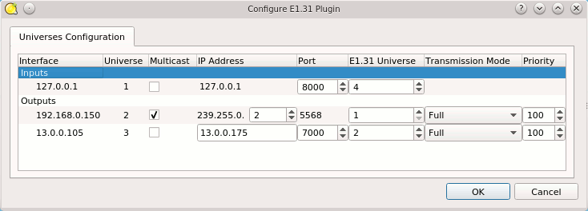

Introducción
------------

QLC+ admite el [protocolo E1.31](https://wiki.openlighting.org/index.php/E1.31) (también conocido como s.ACN) mediante un plugin de input/output que recibe y transmite paquetes en la red.  
No se necesitan requisitos adicionales, ya que QLC+ tiene una implementación nativa del protocolo E1.31 que funciona en sistemas Linux, Windows y OSX.  
El plugin E1.31 puede enviar y recibir paquetes desde múltiples tarjetas de red, direcciones virtuales, el dispositivo de loopback (127.0.0.1) y múltiples universos por interfaz de red.  
Por defecto, los paquetes E1.31 se enviarán como UDP en direcciones multicast como 239.255.0.x, donde 'x' es el número de universo seleccionado en QLC+. El puerto usado es el 5568.  
Al usar el dispositivo de loopback, los paquetes siempre se transmiten usando la dirección 127.0.0.1.  
Al transmitir múltiples universos en la misma interfaz, los paquetes se enviarán por defecto con un ID de universo E1.31 igual al universo de QLC+.  
  
Por ejemplo:  
Universo 1 de QLC+ --> Universo 1 de E1.31 en 239.255.0.1  
Universo 2 de QLC+ --> Universo 2 de E1.31 en 239.255.0.2  
...  
Universo 8 de QLC+ --> Universo 8 de E1.31 en 239.255.0.8  
  
Si la configuración anterior no cumple con los requisitos de su red, lea el siguiente capítulo.

Configuración
-------------

Al hacer clic en el botón de configuración , se mostrará un pequeño diálogo con el panel de Configuración de Universos.  
  
Después de que un universo de QLC+ se haya patcheado con un input u output E1.31, se mostrará una entrada en esta lista, permitiendo configurar manualmente los parámetros deseados que utilizará el plugin E1.31.  
Las líneas de input se pueden configurar con los siguientes parámetros:  

|     |     |
| --- | --- |
| **Multicast** | Esta casilla le permite elegir entre input multicast e input unicast.   Cuando está marcada, este universo recibirá paquetes del grupo multicast elegido en esta interfaz.   Cuando está desmarcada, este universo recibirá paquetes unicast solo en esta dirección IP.   Seleccionar input Unicast permitirá seleccionar un Puerto de input diferente. |
| **Dirección IP** | Es la dirección IP de input que el plugin E1.31 escuchará en la interfaz seleccionada, para este universo de QLC+.   Cuando el input se configura como multicast, puede seleccionar la IP multicast de 239.255.0.1 a 239.255.0.255.   Cuando el input se configura como unicast, la dirección IP queda bloqueada a la dirección IP de la interfaz seleccionada. |
| **Puerto** | Es el puerto de input que el plugin E1.31 escuchará para este universo de QLC+.   Cuando el input se configura como multicast, el puerto queda bloqueado en el puerto multicast E1.31 predeterminado: 5568   Cuando el input se configura como unicast, puede seleccionar cualquier puerto que desee. |
| **Universo E1.31** | Es el universo E1.31 de input que el plugin aceptará para este universo de QLC+.   Esto permite mapear cualquier universo E1.31 a cualquier universo de QLC+. |

  
Ejemplo de configuración de input:

En este ejemplo, al recibir paquetes E1.31 en la dirección 127.0.0.1 y el puerto 8000, los paquetes que operan en el universo E1.31 4 afectarán al universo 1 de QLC+.  
También estamos transmitiendo el universo 2 de QLC+ en la dirección multicast 239.255.0.2, universo E1.31 1, y el universo 3 de QLC+ en la dirección unicast 13.0.0.175 puerto 7000, universo E1.31 2.  
  
Las líneas de output se pueden configurar con los siguientes parámetros:  

|     |     |
| --- | --- |
| **Multicast** | Esta casilla le permite elegir entre output multicast y output unicast.   Cuando está marcada, este universo enviará paquetes al grupo multicast elegido en esta interfaz.   Cuando está desmarcada, este universo enviará paquetes unicast a la dirección IP unicast elegida.   Seleccionar output Unicast también le permitirá seleccionar el puerto de salida. |
| **Dirección IP** | Es la dirección IP de destino a la que el plugin E1.31 transmitirá los paquetes.   Por defecto se usa una dirección multicast, como se describió anteriormente.   Cuando el output se configura como multicast, puede establecer este parámetro dentro del rango 1-255.   Esto permite enviar paquetes al rango multicast de 239.255.0.1 a 239.255.0.255.   Cuando el output se configura como unicast, puede seleccionar cualquier dirección IP arbitraria.   Al patchear un universo de QLC+ al dispositivo de loopback (127.0.0.1), los paquetes unicast siempre se transmitirán a 127.0.0.1. |
| **Puerto** | Es el puerto al que se dirigirán los paquetes salientes.   El puerto E1.31 multicast siempre es 5568.   Cuando el output se configura como unicast, puede seleccionar cualquier puerto que desee. |
| **Universo E1.31** | Es el universo E1.31 que se escribirá realmente en cada paquete transmitido.   Al configurar este parámetro, puede usar cualquier universo de QLC+ para transmitir al universo E1.31 deseado. |
| **Modo de transmisión** | Aquí puede seleccionar si QLC+ debe transmitir universos completos o parciales.   'Full' significa que los 512 canales DMX de un universo se transmiten a la velocidad del reloj interno de QLC+ (50Hz), produciendo una tasa de bits fija de aproximadamente 200kbps.   'Partial', en cambio, significa que QLC+ transmitirá solo el canal DMX realmente usado en un universo, comenzando desde el canal 1. Por ejemplo, si sube el canal 3 de un fixture con dirección 50, el plugin E1.31 transmitirá solo 53 canales DMX, limitando así la tasa de transmisión.   Use este ajuste solo si el nodo E1.31 receptor admite transmisión parcial. |
| **Prioridad** | Prioridad de la fuente E1.31.   **0** es la prioridad mínima, **200** es la máxima, **100** es la prioridad predeterminada.   Cuando un receptor E1.31 recibe datos para un universo particular desde múltiples fuentes, usa los datos de la fuente con mayor prioridad.   Esto permite varios esquemas de failover. Tenga en cuenta que QLC+ todavía no reconoce la prioridad en el input. |

  
Los ajustes que difieran de los valores predeterminados del plugin se guardarán en su espacio de trabajo de QLC+, para aumentar la portabilidad de un proyecto entre diferentes plataformas, como distintos sistemas operativos o un PC y una Raspberry Pi.

Compatibilidad
-------------

QLC+ se ha probado con el siguiente software y dispositivos E1.31:

* [DMXKing eDMX2 TX](https://web.archive.org/web/20160103204133/https://dmxking.com/artnetsacn/edmx2-tx-rdm) \- Dispositivo de output
