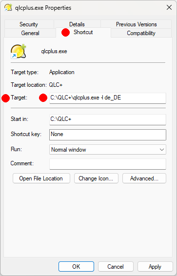

QLC+ suporta una sèrie de paràmetres de línia d'ordres per automatitzar/ampliar algunes funcionalitats en iniciar.  
L'ús dels paràmetres de la línia d'ordres pot ser complicat depenent del sistema operatiu que utilitzeu:

**Linux**: simplement obriu un terminal i escriviu «qlcplus» seguit dels paràmetres que necessiteu 
**Windows**: creeu una drecera de qlcplus.exe (normalment ubicat a C:\\QLC+) a l'escriptori. Feu clic dret a la drecera i seleccioneu «Propietats». Al camp "Objectiu" veuràs una cosa així com `C:\\QLC+\\qlcplus.exe`. Aquí podeu afegir paràmetres de la línia d'ordres. En acabar feu clic a D'acord. 
Per exemple, per forçar l'idioma alemany a l'inici, modifiqueu la línia d'ordres de drecera com aquesta:

**OSX**: Aquest és el cas més difícil, ja que QLC+ a OSX s'inclou en un paquet DMG. Necessites obrir un terminal i executar "cd" al QLC+ DMG com aquest: `cd QLC+.app\\Contents\\MacOS` 
Quan hagis acabat, escriu "qlcplus" seguit dels paràmetres que necessitis

|     |
| --- |
| **-c o --closebutton**  **Descripció:** Defineix una posició per a un botó de tancament a la consola virtual. El botó es pot utilitzar per tancar QLC+. Només té efecte en mode quiosc (vegeu -k) i és més útil quan està en mode de pantalla completa sense un gestor de finestres.  **Paràmetres:** x,y,w,h  **Exemples:**   Crea un botó a (x400, y500) la mida del qual sigui (w70, h50):   qlcplus -c 400,500,70,50   qlcplus --closebutton 400,500,70,50 |

|     |
| --- |
| **-d o --debug**  **Descripció:** Activa el mode de depuració i opcionalment estableix el nivell de sortida. Tingueu en compte que, des de la versió 4.8.0, els missatges per a la DEPURACIÓ de nivell (0) no s'inclouen en els binaris llançats.  **Paràmetres:** Nivell (vegeu QtMsgType[)](https://doc.qt.io/qt-5/qtglobal.html#QtMsgType-enum)  **Exemples:**   Habilita el mode de depuració i estableix el nivell de depuració a 0   qlcplus -d   qlcplus --debug      Activa el mode de depuració i estableix el nivell de depuració a 3:  qlcplus -d 3 |

|     |
| --- |
| **-f o --fullscreen**  **Descripció:** Inicia l'aplicació en mode de pantalla completa  ** Paràmetres:** Mètode (ja sigui 'normal' o 'redimensionar')  **Exemples:**   Digues al gestor de finestres que doni espai a tota la pantalla a QLC+ : qlcplus  -f qlcplus  --fullscreen qlcplus -f normal   qlcplus --fullscreen normal      Redimensiona QLC+ per ocupar tot l'espai de la pantalla (útil en sessions X11 personalitzades sense un gestor de finestres):  qlcplus -f resize  qlcplus --fullscreen resize |

|     |
| --- |
| **-g o --log**  **Descripció:** Registra els missatges de depuració a un fitxer (`$HOME/QLC+.log`)  **Paràmetres:**1 Cap  **Exemples:**  Habilita els missatges de depuració i emmagatzema'ls per registrar  qlcplus -d 0 -g  qlcplus --debug 0 --log |

|     |
| --- |
| **-h o --help**  **Descripció:** Mostra l'ajuda de la línia d'ordres (només en Linux i OS X)  **Paràmetres:** Cap**0 **1**Exemples:**  Mostra l'ajuda de la línia d'ordres:  qlcplus -h  qlcplus --help |

|     |
| --- |
| **-k o --kiosk**  **Descripció:** Activa el mode quiosc (només és visible la [consola virtual](/virtual-console) i l'aplicació està bloquejada en [mode d'operació](/basics/glossary-and-concepts#modes))  **Paràmetres:** Cap  **Exemples:**   Inicia l'aplicació en mode quiosc:   qlcplus -k   qlcplus --kiosk |

|     |
| --- |
| **-l o** --locale  ** Descripció:** Utilitza l'idioma indicat per a la traducció  **Paràmetres:** Codi d'idioma (actualment admès: ca\_ES, cz\_CZ, de\_DE, en\_GB, es\_ES, fi\_FI, fr\_FR, it\_IT, ja\_JP, nl\_NL, pt_BR)  **Exemples:**   Utilitza l'idioma finès:   qlcplus -l fi_FI   qlcplus --locale fi_FI |

|     |
| --- |
| **-m o --nowm**  **Descripció:** Informa l'aplicació que el sistema no proporciona un gestor de finestres. Per tant, QLC+ afegirà alguns controls addicionals per tancar les finestres.  **Paràmetres:** Cap  **Exemples:**   Iniciar QLC+ sense gestor de finestres:   qlcplus -m   qlcplus --nowm |

|     |
| --- |
| **-n o --nogui**  **Descripció:** Inicia l'aplicació amb la interfície gràfica oculta (només Raspberry Pi)  **Paràmetres:** Cap  **Exemples:**   Inicia QLC+ sense interfície gràfica visible:   qlcplus -n   qlcplus --nogui |

|     |
| --- |
| **-o o --open**  **Descripció:**Obre el fitxer de l'espai de treball donat  **Paràmetres:** Nom del fitxer  **Exemples:**   Obre mydesk.qxw:  qlcplus -o mydesk.qxw   qlcplus --open mydesk.qxw |

|     |
| --- |
| **-p o --operate**  **Descripció:** Inicia l'aplicació en mode [Operate](/basics/glossary-and-concepts#modes).  **Paràmetres:** Cap  **Exemples:**   Iniciar QLC+ en mode d'operació:   qlcplus -p   qlcplus --operate |

|     |
| --- |
| **-v o --version**  **Descripció:** Mostra el número de versió actual de l'aplicació  **Paràmetres:** Cap**0 **1**Exemples:**  qlcplus -v  qlcplus --version |

|     |
| --- |
| **-w o --web**  **Descripció:** Activa l'accés remot a la web al port 9999  **Paràmetres:** Cap**0 **1**Exemples:**  qlcplus -w  qlcplus --web |

|     |
| --- |
| **-wp o --web-port**  **Descripció:** Utilitzar un port específic per a l'accés web  **Paràmetres:** Número de port  **Exemples:**   qlcplus -wp 12345   qlcplus --web-port 12345 |

|     |
| --- |
| **-wa o --web-auth**  **Descripció:** Activa l'accés web remot amb l'autenticació dels usuaris  **Paràmetres:** Cap  **Exemples:**   qlcplus -wa   qlcplus --web-auth |

|     |
| --- |
| **-a o --web-auth-file**  **Descripció:** Especifiqueu un fitxer on emmagatzemar les credencials d'autenticació bàsica d'accés web  **Paràmetres:** Nom del fitxer  **Exemples:**   qlcplus -wa qlcplus_passwd   qlcplus --web-auth-file qlcplus_passwd |
