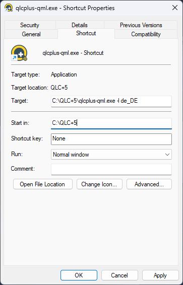

QLC+ supports a number of command line parameters to automate/extend some functionalities on startup.  
Using command line parameters can be tricky depending on the operating system you're using:

**Linux**: just open a terminal and type `qlcplus-qml` followed by the parameters you need 
**Windows**: create a shortcut of qlcplus-qml.exe (usually located in C:\\QLC+) on your desktop. Right click on the shortcut and select "Properties". In the "Target" field you will see something like `C:\\QLC+\\qlcplus-qml.exe`. There you can add command line parameters. When done click OK. 
For example, to force the German language at startup, modify your shortcut command line like this:

**OSX**: This is the most difficult case since QLC+ on OSX is bundled into a DMG package. You need to open a terminal and "cd" into the QLC+ DMG like this: `cd QLC+.app\\Contents\\MacOS` 
When done, type `./qlcplus-qml` followed by the parameters you need.

|     |
| --- |
| **-o or --open**  **Description:** Open the given workspace file  **Parameters:** File name  **Examples:**   Open sample.qxw:   qlcplus-qml -o sample.qxw   qlcplus-qml --open sample.qxw |

|     |
| --- |
| **-9 or --openlast**  **Description:** Open the project file from last session  **Parameters:** None  **Examples:**   Open the last opened file:   qlcplus-qml -9   qlcplus-qml --openlast |

|     |
| --- |
| **-f or --fullscreen**  **Description:** Start the application in fullscreen mode  **Parameters:** None  **Examples:**   Tell the window manager to give the whole screen space to QLC+:   qlcplus-qml -f   qlcplus-qml --fullscreen |

|     |
| --- |
| **-h or --help**  **Description:** Display command-line help (only on Linux and macOS)  **Parameters:** None  **Examples:**   Display the command-line help:   qlcplus-qml -h   qlcplus-qml --help |

|     |
| --- |
| **-3 or --no3d**  **Description:** Disable the 3d preview sub-context  **Parameters:** None  **Examples:**   Disable the 3d preview:   qlcplus-qml -3   qlcplus-qml --no3d |

|     |
| --- |
| **-k or --kiosk**  **Description:** Enable kiosk-mode (only [virtual console](/virtual-console) is visible)  **Parameters:** None  **Examples:**   Start the application in kiosk mode:   qlcplus -k   qlcplus --kiosk |

|     |
| --- |
| **-l or --locale**  **Description:** Use the given language for translation  **Parameters:** Language code (currently supported: ca\_ES, de\_DE, en\_GB, es\_ES, fr\_FR, it\_IT, ja\_JP, nl\_NL, pl\_PL, ru\_RU, uk\_UA)  **Examples:**   Use finnish language:   qlcplus-qml -l fi_FI   qlcplus-qml --locale fi_FI |

|     |
| --- |
| **-m or --nowm**  **Description:** Inform the application that the system doesn't provide a window manager. QLC+ will therefore add some extra controls to close the windows.  **Parameters:** None  **Examples:**   Start QLC+ with no window manager:   qlcplus-qml -m   qlcplus-qml --nowm |

|     |
| --- |
| **-v or --version**  **Description:** Display the current application version number  **Parameters:** None  **Examples:**   qlcplus-qml -v   qlcplus-qml --version |

|     |
| --- |
| **-w or --web**  **Description:** Enable remote web access on port 9999  **Parameters:** None  **Examples:**   qlcplus-qml -w   qlcplus-qml --web |

|     |
| --- |
| **-wp or --web-port**  **Description:** Use a specific port for web access  **Parameters:** Port number  **Examples:**   qlcplus-qml -wp 12345   qlcplus-qml --web-port 12345 |

|     |
| --- |
| **-wa or --web-auth**  **Description:** Enable remote web access with users authentication  **Parameters:** None  **Examples:**   qlcplus-qml -wa   qlcplus-qml --web-auth |

|     |
| --- |
| **-a or --web-auth-file**  **Description:** Specify a file where to store web access basic authentication credentials  **Parameters:** File name  **Examples:**   qlcplus-qml -wa qlcplus_password   qlcplus-qml --web-auth-file qlcplus_password |

|     |
| --- |
| **-d or --debug**  **Description:** Enable debug mode. Note that debug messages are not included in released binaries.  **Parameters:** None  **Examples:**   Enable debug mode:   qlcplus-qml -d   qlcplus-qml --debug     |

|     |
| --- |
| **-g or --log**  **Description:** Log debug messages to a file (`$HOME/QLC+.log`)  **Parameters:** None  **Examples:**   Enable debug messages and store them to log   qlcplus -d -g   qlcplus --debug --log |
