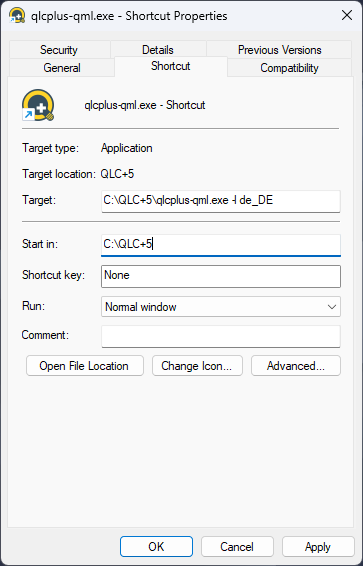

QLC+ suporta una sèrie de paràmetres de línia d'ordres per automatitzar/ampliar algunes funcionalitats en iniciar-se.  
L'ús de paràmetres de línia d'ordres pot ser complicat depenent del sistema operatiu que utilitzeu:

**Linux**: simplement obriu un terminal i escriviu `qlcplus-qml` seguit dels paràmetres que necessiteu 
**Windows**: creeu una drecera de qlcplus-qml.exe (normalment ubicat a C:\\QLC+) al vostre escriptori. Feu clic dret a la drecera i seleccioneu "Propietats". Al camp "Objectiu" veureu una cosa com `C:\\QLC+\\qlcplus-qml.exe`. Allà podeu afegir paràmetres de línia d'ordres. Quan acabeu feu clic a D'acord. 
Per exemple, per forçar l'idioma alemany a l'inici, modifiqueu la línia d'ordres de la drecera així:

**OSX**: Aquest és el cas més difícil, ja que QLC+ a OSX s'inclou en un paquet DMG. Cal obrir un terminal i fer "cd" al DMG de QLC+ així: `cd QLC+.app\\Contents\\MacOS` 
Quan hàgiu acabat, escriviu `./qlcplus-qml` seguit dels paràmetres que necessiteu.

|     |
| --- |
| **-o o --open**  **Descripció:** Obre el fitxer d'espai de treball indicat  **Paràmetres:** Nom del fitxer  **Exemples:**   Obre sample.qxw:   qlcplus-qml -o sample.qxw   qlcplus-qml --open sample.qxw |

|     |
| --- |
| **-9 o --openlast**  **Descripció:** Obre el fitxer de projecte de l'última sessió  **Paràmetres:** Cap  **Exemples:**   Obre l'últim fitxer obert:   qlcplus-qml -9   qlcplus-qml --openlast |

|     |
| --- |
| **-f o --fullscreen**  **Descripció:** Inicia l'aplicació en mode de pantalla completa  **Paràmetres:** Cap  **Exemples:**   Digueu al gestor de finestres que doni tot l'espai de la pantalla a QLC+:   qlcplus-qml -f   qlcplus-qml --fullscreen |

|     |
| --- |
| **-h o --help**  **Descripció:** Mostra l'ajuda de la línia d'ordres (només a Linux i macOS)  **Paràmetres:** Cap  **Exemples:**   Mostra l'ajuda de la línia d'ordres:   qlcplus-qml -h   qlcplus-qml --help |

|     |
| --- |
| **-3 o --no3d**  **Descripció:** Desactiva el subcontext de previsualització 3d  **Paràmetres:** Cap  **Exemples:**   Desactiva la previsualització 3d:   qlcplus-qml -3   qlcplus-qml --no3d |

|     |
| --- |
| **-k o --kiosk**  **Descripció:** Activa el mode quiosc (només és visible la [consola virtual](/virtual-console)  **Paràmetres:** Cap  **Exemples:**   Inicia l'aplicació en mode quiosc:   qlcplus -k   qlcplus --kiosk |

|     |
| --- |
| **-l o --locale**  **Descripció:** Utilitza l'idioma indicat per a la traducció  **Paràmetres:** Codi d'idioma (actualment admesos: ca\_ES, cz\_CZ, de\_DE, en\_GB, es\_ES, fi\_FI, fr\_FR, it\_IT, ja\_JP, nl\_NL, pt_BR)  **Exemples:**   Utilitza l'idioma finès:   qlcplus-qml -l fi_FI   qlcplus-qml --locale fi_FI |

|     |
| --- |
| **-m o --nowm**  **Descripció:** Informa l'aplicació que el sistema no proporciona un gestor de finestres. QLC+ afegirà per tant alguns controls addicionals per tancar les finestres.  **Paràmetres:** Cap  **Exemples:**   Inicia QLC+ sense gestor de finestres:   qlcplus-qml -m   qlcplus-qml --nowm |

|     |
| --- |
| **-v o --version**  **Descripció:** Mostra el número de versió actual de l'aplicació  **Paràmetres:** Cap  **Exemples:**   qlcplus-qml -v   qlcplus-qml --version |

|     |
| --- |
| **-w o --web**  **Descripció:** Activa l'accés web remot al port 9999  **Paràmetres:** Cap  **Exemples:**   qlcplus-qml -w   qlcplus-qml --web |

|     |
| --- |
| **-wp o --web-port**  **Descripció:** Utilitza un port específic per a l'accés web  **Paràmetres:** Número de port  **Exemples:**   qlcplus-qml -wp 12345   qlcplus-qml --web-port 12345 |

|     |
| --- |
| **-wa o --web-auth**  **Descripció:** Activa l'accés web remot amb autenticació d'usuaris  **Paràmetres:** Cap  **Exemples:**   qlcplus-qml -wa   qlcplus-qml --web-auth |

|     |
| --- |
| **-a o --web-auth-file**  **Descripció:** Especifica un fitxer on emmagatzemar les credencials d'autenticació bàsica d'accés web  **Paràmetres:** Nom del fitxer  **Exemples:**   qlcplus-qml -wa qlcplus_password   qlcplus-qml --web-auth-file qlcplus_password |

|     |
| --- |
| **-d o --debug**  **Descripció:** Activa el mode de depuració. Tingueu en compte que els missatges de depuració no s'inclouen als binaris publicats.  **Paràmetres:** Cap  **Exemples:**   Activa el mode de depuració:   qlcplus-qml -d   qlcplus-qml --debug     |

|     |
| --- |
| **-g o --log**  **Descripció:** Registra els missatges de depuració a un fitxer (`$HOME/QLC+.log`)  **Paràmetres:** Cap  **Exemples:**   Activa els missatges de depuració i emmagatzema'ls al registre   qlcplus -d -g   qlcplus --debug --log |
